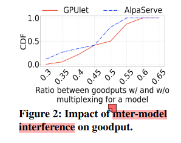
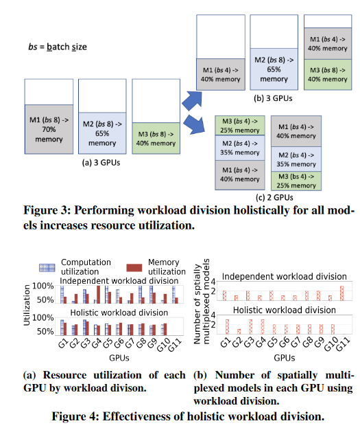
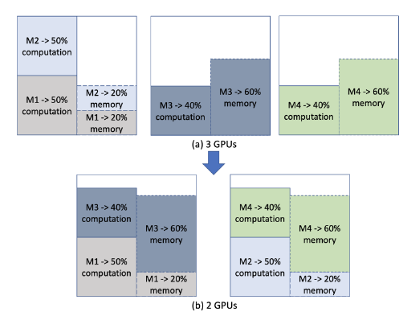
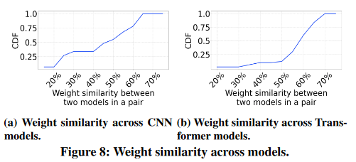
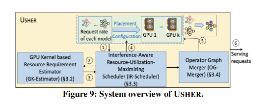
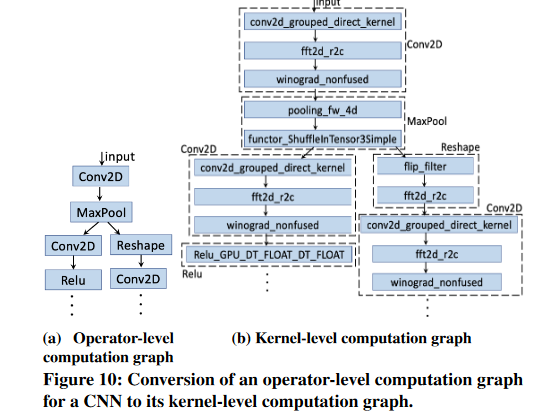
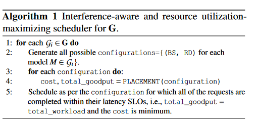
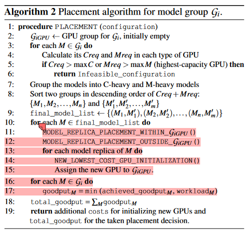

# Usher: Holistic Interference Avoidance for Resource Optimized ML Inference论文笔记

发布时间：2024-10-25  
最后更新：2024-11-06  
归档主题：GPU 系统与资源调度  
原文：https://sysufyj.github.io/2024/10/25/Usher-Holistic-Interference-Avoidance-for-Resource-Optimized-ML-Inference%E8%AE%BA%E6%96%87%E7%AC%94%E8%AE%B0/

> 从网页恢复的阅读副本；非 Hexo 原始 Markdown。

随着深度学习模型的日益普及，最小化货币成本和最大化推理服务系统的吞吐量变得越来越重要。虽然希望对 GPU 资源进行空间复用以提高利用率，但现有技术受到模型间干扰的影响，这阻碍了它们同时实现高计算和内存利用率。我们推出了 USHER，这是一个能够以整体方式最大限度地提高资源利用率，同时具有干扰感知能力的系统。 USHER 由三个关键组件组成：1) 一个经济高效且快速的基于 GPU 内核的模型资源需求估计器，2) 一个轻量级的基于启发式的干扰感知资源利用率最大化调度程序，用于决定批量大小、模型复制程度和模型放置最小化货币成本，同时满足延迟 SLO 或最大化吞吐量，以及 3) 一种新颖的运算符图合并，用于合并类似权重的多个模型，以最大程度地减少 GPU 缓存中的干扰。使用生产工作负载的大规模实验表明，与现有方法相比，USHER 的吞吐量提高了 2.6 倍，成本效率提高了 3.5 倍，同时可扩展到数千个 GPU。

代码：<https://github.com/ss7krd/Usher/>

# 文章主体

我们使用 Cuti 和 Muti 分别表示 GPU 计算和内存利用率，并使用 Creq 和 Mreq 表示模型对它们的要求。模型的 Creq（或 Mreq）是模型在执行期间的任何时刻消耗的 GPU 总计算（或内存）空间的最高百分比。我们进一步用Rreq来表示Mreq和Creq的和。我们使用 C-heavy 和 M-heavy 分别表示计算密集型和内存密集型。

## 基本发现

观察1.现有的推理服务系统无法最大化Cuti或Muti，并且它们的模型复用由于模型干扰而显着降低了吞吐量。此外，最大化 Cuti 并不一定最大化 Muti。（很多模型都是C重或是M重的）

观察2.在基于空间复用的推理服务中，与现有系统不同，即使一个 GPU 足以完成 SLO 内的工作负载，我们也可能需要划分模型的工作负载，以提高整体资源利用率。（图4）

观察 3. 不应为每个模型单独决定最佳工作负载划分。相反，同时考虑所有模型的整体方法至关重要。（参考图3）

一般概念假设大模型具有高 Creq 和 Mreq，而小模型具有低 Creq 和 Mreq。然而，这种区别忽略了 BS 在推理服务中的影响。增加 BS 可能会提高资源使用率，但存在延迟违规和内存溢出的风险。这凸显了 Cuti 和 Muti 在工作负载调度方面的微妙平衡。例如，当我们在 Nvidia H100 GPU 中以 BS=4 执行 LlaMA-2（具有 130 亿个参数）时，它几乎占用了所有 GPU 内存，但有 45% 的 Cuti 未使用。进一步增加 BS 会导致内存溢出。因此，尽管它是一个大型模型，但它是 M 重而不是 C 重。另一方面，BS=128 的 MobileNetV2（只有 340 万个参数）的 Cuti 高达 93%，但 Muti 为 30%。进一步增加 BS 会违反其 64 毫秒 SLO。因此，它是 C 重模型而不是 M 重模型。图 6a 显示了模型的 CDF 与模型的比率 Creq/Mreq 的关系。我们看到 22% 的模型的比率≤0.75，表明它们是 M 重的。另外，28%的模型的比率在(1.35,1.65]，表明它们是Cheavy。Llama-2是M重模型(即Mreq/Creq≥1.2)。在其他小模型中，39%是M -heavy，2% 具有可比的 Creq 和 Mreq，其余为 C-heavy（即 Creq/Mreq≥1.2）。

观察4.与普遍看法不同，模型参数大小本身并不能决定模型是 Cheavy 还是 M-heavy。在 BS、依赖于 BS 的资源需求和 SLO 之间复杂关系的驱动下，即使是一个小模型也可以超越 Creq 中的较大模型。

观察 5. 将 C 重模型与 M 重模型复用会增加 GPU 的 Cuti 和 Muti。

给定 CNN 模型 A 和 B，我们首先找到两个模型中每个可能的卷积层对之间的权重相似性。然后，我们将所有层对的平均权重相似度作为两个模型之间的权重相似度。为了找到第 i 层和第 j 层之间的权重相似度，其中 Lx 表示模型 x 中所有卷积层的集合，我们计算了 2×|max(Wi A∩W j B )| |W i A|+|W j B| ，其中 max(W i A ∩W j B ) 表示权重矩阵 W i A 和 W j B 之间的最长公共子矩阵。如果两个权重值的绝对差异非常小，我们认为它们相同

观察 6. 不同 CNN 模型之间以及不同 Transformer 模型之间存在显着的权重重叠。

## 系统设计

### 基于 GPU 内核的资源需求估计器（GK-Estimator）。

（上面形成的二部图就是算子生成的图，边是输入输出的中介数据）

估计器根据给定的配置快速、正确地计算 GPU 类型中模型的 Creq 和 Mreq。

离线分析估计每个新模型的 Creq 和 Mreq 的常用方法。然而，这是昂贵且耗时的。为了应对这一挑战，我们提出了 GK-Estimator，它通过分析低级 GPU 内核来独立估计每个模型的资源需求，而无需在 GPU 中实际运行模型。我们以 Mreq 为例来解释 GK-Estimator 的工作原理。每个模型都可以被视为一个计算图，其中节点是算子，边是张量（即多维矩阵），表示模型输入或模型层生成的中间数据。在内部，每个算子执行都涉及顺序调用 GPU 编程框架中定义的一个或多个 GPU 内核 API（例如，用于 Nvidia GPU 的 CUDA、用于 AMD GPU 的 ROCm）。对于 ONNX 中定义的每个运算符，我们使用 Nvidia Profiling 工具发现在运算符执行期间 ML 框架调用了哪些 GPU 内核。我们注意到，分别有 2%、8%、56% 和 34% 的算子调用了 1、2、3 和 4 个 GPU 内核。

新模型的算子通常来自一组预先已知的算子 [53, 54]。因此，GK-Estimator 使用回归模型，根据输入张量的大小和算子的数学运算，快速计算算子生成的中间数据所需的内存。那么，对于顺序DL模型，其Mreq是模型参数大小和算子所需的最高内存之和。具有并行分支的模型的内存需求来自并发执行的内核的中间数据的Meqs。然后，如图 10 所示，首先，GK-Estimator 通过用其调用的 GPU 内核序列替换每个运算符，将运算符级计算图转换为内核级计算图。对于 ONNX 中的每个操作员，都会离线找到此序列。然后，它找到将同时执行的每组内核。接下来，对于每个集合，它通过回归模型（称为MreqRegressor）估计集合中每个内核生成的中间数据的Mreq，然后将集合中所有内核的Mreq求和。最后，将**模型参数大小与所有集合中的最大内存需求之和**作为模型的Mreq。

模型的第一个内核（即直接获取模型输入的内核）的启动时间为 0thms。为了确定哪些内核将同时执行，GK-Estimator 首先查找每个内核的开始时间。它使用另一个回归模型来估计每个内核的执行时间持续时间（称为时间回归器）。启动时间差不超过 τms（例如 0.001ms）的内核被视为可能同时运行。

使用一个集成学习回归器离线训练，可以达到98%的准确率。

### 干扰感知资源利用率最大化调度程序（IR 调度程序）。

USHER 不是解决复杂度很高的优化问题，而是提供轻量级启发式方法来快速导出时间表。它首先以最大化在组内复用 C 重模型和 M 重模型的机会的方式对模型进行分组。然后，在每个组中，它选择能够实现特定目标（通过利用 O2-5）的最佳性能的配置。 IR-Scheduler 确保每个模型副本在其所在的 GPU 中获取其 Creq 和 Mreq，从而确保 C 空间和 M 空间中不存在模型间干扰。

#### 分组

基于O4和O5，将C重模型与M重模型复用可以最大化Ruti。这种多路复用使得 GPU 的 Cuti 和 Muti 具有可比性。如果 GPU 的 C 空间远低于其 M 空间，反之亦然，它可能无法托管额外的模型。

基于此，我们在复用模型时遵循一个原则。也就是说，模型的 Creq 之和几乎等于 GPU 中模型的 Mreq 之和（即 Σi Creqi ≈ Σi Mreqi）。在此基础上，USHER 对模型进行分组，使得每组中的模型 **Σi Creqi ≈ Σi Mreqi**。

在进行分组之前，USHER首先找到每个模型的Creq和Mreq。 USHER 使用 GK-Estiamtor（第 3.2 节中所述）计算所有可能的 BS 和 GPU 类型组合的平均 Rreq。对于 GPU 类型，USHER 在 Creq 或 Mreq 分别超过该类型的最大 C 空间或 M 空间的 BS 处停止。接下来，USHER 使用 **k 均值聚类**的变体进行分组 [56]。一开始，每个组都由一个模型组成。 USHER 将每两个模型之间的距离计算为 D = | Σi Creqi − Σi Mreqi|。然后，它使用k-means算法将模型分为几组，其中每组由两个模型组成，使得D最小化，即每组的Σi Creqi ≈ Σi Mreqi。接下来，将每个组视为一个元素，USHER 执行算法的另一遍。此过程将前一遍创建的两个组合并为一个，并将每组中的模型数量增加两倍。因此，如果我们决定每组中最多有 2p（即 4）个模型，则需要执行 p 遍算法。最后，模型被分为几组，组的集合表示为 G = {G1, G2, …, Gn}。（两两分组）

#### 调度

算法2比较难理解：放置算法如算法 2 所示。USHER 首先根据使用 GKEstimator 作为输入给出的配置计算每个 GPU 类型中每个模型的 Creq 和 Mreq（第 3-4 行）。然后进一步将模型组 Gi 中的模型分为 C 重模型和 M 重模型（第 7 行）。如果模型的平均 C-req/M-req ≥ 1.2，则模型为 C 重；如果 M-req/C-req ≥ 1.2，则模型为 M 重。接下来，USHER 按 Creq+Mreq 的降序对两个子组中的每一个进行排序（第 8 行）。之后，USHER 将两个子组中的每两个模型配对以创建 Final\_model\_list（第 9 行）。最后，USHER 将既不是 C 重也不是 M 重的模型插入到列表中，同时保持 Creq+Mreq 的降序。然后，USHER 从列表中逐一挑选一对或一个模型以分配给 GPU。

具体来说，USHER 调用 MODEL\_REPLICA\_PLACEMENT\_WITHIN\_GiGPU 函数（第 11 行）。该函数将尽可能多的 M 模型副本放置到该模式的 GPU 组（用 GiGPU 表示）中。模型组的 GPU 组定义为托管模型组的大部分模型副本的 GPU 组。基本上，当 USHER 为模型组 Gi 的任何模型副本初始化新 GPU 时，新 GPU 就会添加到 GPU 组 GiGPU 中。这样，USHER 会尝试将同一模型组中的模型副本放置到同一 GPU 组的 GPU 上。如果一个模型或一对模型有多个 GPU 可用，**USHER 会选择托管后留下最低 C 空间 + M 空间的 GPU，以避免资源碎片。**

之后，USHER 调用 MODEL\_REPLICA\_PLACMENT\_OUTSIDE\_GiGPU，将尽可能多的 M 剩余模型副本放置到其他 GPU 组的 GPU 上（第 12 行）。最后，对于尚未放置到任何 GPU 的每个模型副本，USHER **调用NEW\_LOWEST\_COST\_GPU\_INITIALIZATION 来初始化可以以最低成本托管模型或配对的 GPU 类型的新 GPU，并将 GPU 分配给 GiGPU**（第 1315 行）。最后，布局算法将初始化新 GPU 的额外成本以及所有模型的总吞吐量返回给调度算法（第 19 行）。如[14]，模型的有效吞吐量被视为批量大小与第 954 届 USENIX 操作系统设计与实现 USENIX 协会完成批量的预期时间（包括队列等待时间）之间的比率。

### 算子图合并（OG-Merger）。

决定放置位置后，OG-Merger 会合并尽可能多的分配给 GPU 的模型的算子图，以最大限度地减少 GPU 缓存中的模型间干扰。合并后，合并后的图所分配的资源是分配给已合并图的模型（由 IR-Scheduler 决定）的资源总和。请注意，IR 调度程序不满足模型的缓存要求，我们发现在第 2 节的设置中几乎 100% 满足模型的缓存要求。因此，满足高速缓存要求会导致C空间和M空间的利用不足。这就是 USHER 在 OG-Merger 中单独解决缓存干扰的原因。

为了最大限度地减少 GPU 缓存的干扰，在分配给一个 GPU 的模型中，USHER 将尽可能多的模型运算符图合并到单个图中。为了执行最大算子图合并，USHER 首先根据模型的架构相似性（即结构和构成算子）将模型分组为子组。然后，对于每个子组，在 O6 的推动下，USHER 根据权重相似性决定多个图中要合并的运算符。最后，在合并过程中，USHER提取出需要合并的算子之间的最大公共权子矩阵，并确保同时处理不同模型的不同输入的与该子矩阵相关的矩阵乘法，而该子矩阵为在 GPU 缓存中。

#### 对类似架构的操作分组

具有类似架构的算子图的模型的权重更有可能具有高度相似性。基于此，USHER 使用 DBSCAN 算法根据架构相似性对分配给 GPU 的模型进行分组。给定一组元素，DBSCAN 算法可以将元素之间距离很小（即 10−7）的元素聚集在同一组内，而不需要任何预定数量的组或组内的元素数量。在 DBSCAN 算法中，USHER 使用图编辑距离 来计算距离来衡量两个算子图之间的架构相似性。基本上，编辑距离算法发现需要执行多少操作符的添加/删除/替换才能使两个操作符图相同。距离越短意味着架构相似度越高。

#### 决定多个图中合并的运算符

USHER 首先随机抽取两个模型。然后，它生成包含两个模型的运算符的二部图 B。当且仅当满足以下所有条件时，两个图的两个顶点之间存在边 e：(i) 相同类型（即卷积算子或注意力算子），(ii) 相同的起始时间（第 3.2 节中解释） ), (iii) 算子之间的权重相似度（第 2.4 节中描述）不小于 ω（例如 40%）。它被指定为边权重。生成 B 后，U SHER 在 B 中使用匈牙利算法 [59] 找到最大加权匹配，该算法选择一组独立的边（即不共享任何公共顶点），以使权重之和最大化。每条所选边的两个端点运算符都匹配并将被合并（第 3.4.2 节中进行了说明）。然后，USHER 从剩余模型中随机取出另一个模型，并通过重复相同的过程，使用 B 和另一个模型生成新的二分图 B’。重复此过程，直到组中不再有模型可以合并为止。

#### 执行合并操作

作为运算符合并的示例，我们描述了两个 Transformer 模型的注意力层中两个 Query 运算符的过程。它是一个矩阵乘法运算：I′ 1 = W1I1，其中I1是输入，W1是查询权重矩阵。现在，我们解释 USHER 如何修改此操作以进行运算符合并。如果 I1 和 I2 以及 W1 和 W2 的大小不同，我们将应用零填充以使它们大小相同。

只要加载一遍W1和W2重合的Ws，然后把矩阵乘法分配律用上之后分开：I′ 1 = W sI1 + W R 1 I1.

## 实验实践

除了表1中描述的模型之外，我们还使用了两个包含多个DL模型的多模型应用程序：视频监控（SLO：500ms）[2]和社交媒体（SLO：750ms）[65] 。

除了具有稳定和密集的请求到达率的 Microsoft Azure Function Trace 2019 (MAF1) 之外，我们还尝试了具有突发到达率的 MAF Trace 2021 (MAF2) [66]。 (a) MAF1 (b) MAF2 图 13：固定集群的实际测试台中不同方法的良好吞吐量比较。 (a) MAF1 (b) MAF2 我们进行了真实测试台和模拟实验。真正的测试床是一个包含 6 个 AWS EC2 p3.8xlarge 服务器的集群，每个服务器由 4 个 V100 Nvidia GPU 组成，并且 GPU 通过 NVLink 互连。在模拟中，我们将GPU数量增加到6000个，以模拟大型企业级GPU集群[67]。由于使用如此多的 GPU 实际执行模型的成本极其昂贵，因此我们直接从调度程序决策中报告结果，而不实际运行模型。在模拟中，我们尝试了高达 15M 请求/秒的超大工作负载，以模拟企业级集群中的大型工作负载。我们测试了固定和非固定集群设置。我们将 USHER 与 Shepherd [3]、GPUlet [14] 和 AlpaServe [4] 进行了比较。

主要实验包括：

* 固定配置集群
* 非固定集群

  + 同质GPU
  + 异构GPU
* overhead：对模型正确率的影响
* 限制SLO情况下

  + 固定集群
  + 非固定集群
* 不同工作负载下GPU可扩展性
* 消融实验
* 敏感性分析（w和t）

结果略，反正表现很好就对了。

# 术语积累

## 计算利用率和内存利用率

GPU 内存利用率（Muti）和计算利用率（Cuti）的需求主要由模型的任务类型和架构决定，不同类型的模型会对内存和计算资源提出不同的要求。

### 1. 内存利用率需求高的模型

**图像生成模型（如 GANs）**和**大规模预训练语言模型（如 GPT-3、BERT）**通常对内存有很高需求。这类模型的参数量较大，尤其是预训练语言模型，它们需要存储大量的词嵌入和参数矩阵。因此，在推理或训练中，它们的内存需求通常较高。此外：

* **Transformer 模型**（如 BERT 和 GPT）因其自注意力机制，需存储大量激活值和中间结果，导致内存需求增加。
* **卷积神经网络（CNN）**用于高分辨率图像处理时，也需要较高的内存来存储特征图。

### 2. 计算利用率需求高的模型

\*\*卷积神经网络（CNNs）\*\*和\*\*图像分类或对象检测模型\*\*（如 ResNet、YOLO 等）通常是计算密集型。这些模型会进行大量矩阵乘法和卷积操作，因而对计算资源的需求较大。此外：

* **视频处理模型**也有高计算需求，因为要处理每一帧图像，并可能涉及时间上的信息建模。
* **Recurrent Neural Networks（RNNs）**和 LSTM 也由于其时间依赖性操作（如在序列数据上的递归操作），在长序列数据上对计算资源需求较高。

### 3. GPU 的内存和计算利用率决定因素

GPU 的架构在很大程度上决定了内存利用率和计算利用率的表现，具体包括以下几点：

* **CUDA 核心数量和频率**：决定了 GPU 可以进行的并行计算能力，从而影响计算利用率。
* **内存带宽和显存大小**：内存带宽越大，GPU 处理内存密集型任务的效率越高，显存大小也会影响大型模型是否能完全加载进 GPU。
* **SM（Streaming Multiprocessor）数量和结构**：这直接决定了每个 GPU 核心的处理能力和任务分配情况，进而影响计算和内存的综合利用率。
* **缓存机制和内存管理**：较高的缓存可以提升模型执行速度，减少对全局内存的依赖，提高总体利用效率。

不同架构和模型的组合会直接影响 GPU 的计算和内存使用表现，因此在选择 GPU 时，需根据模型需求做出针对性选择。

## SLO

在 GPU 计算中，SLO（Service Level Objective，服务级别目标） 是用来定义 GPU 服务性能的目标标准。SLO 的设定主要是为了确保服务能够达到特定的性能要求，例如响应时间、延迟、吞吐量或资源利用率等，从而为任务提供稳定和高效的计算环境。对 GPU 来说，SLO 通常设定的目标会围绕延迟、计算时间、资源占用比（如计算或内存利用率）等，以满足用户的需求或应用的实时性要求

## BS和RD

**BS（Batch Size，批量大小）**：指模型在 GPU 上执行时的批处理数量，即模型每次传入 GPU 的数据量大小。批量越大，通常能够更好地利用 GPU 计算资源，但也可能受到 GPU 内存的限制。

**RD（Replication Degree，复制度）**：指模型的复制数量，以提高并发度。每个模型可以创建多份副本（replica），RD 就是副本的数量。增大 RD 值可以分散模型负载，提高任务完成速度，但需要更多的 GPU 资源。
