# Microsecond-scale Preemption for Concurrent GPU-accelerated DNN Inferences论文笔记

发布时间：2024-11-01  
最后更新：2024-11-01  
归档主题：GPU 系统与资源调度  
原文：https://sysufyj.github.io/2024/11/01/Microsecond-scale-Preemption-for-Concurrent-GPU-accelerated-DNN-Inferences%E8%AE%BA%E6%96%87%E7%AC%94%E8%AE%B0/

> 从网页恢复的阅读副本；非 Hexo 原始 Markdown。

自动驾驶和虚拟现实等许多智能应用程序都需要运行延迟关键型和尽力而为的 DNN 推理任务，以在 GPU 上实现实时性和节省工作量。然而，商用 GPU 缺乏高效的抢占式调度支持，最先进的方法要么必须独占 GPU，要么让实时任务等待尽力而为的任务完成，这会导致利用率低或延迟高，或两者兼而有之。本文介绍了 REEF，这是第一个 GPU 加速的 DNN 推理服务系统，可在 GPU 调度中实现微秒级内核抢占和受控并发执行。 REEF 有两个新颖之处。首先，**基于 DNN 推理内核大多具有幂等性的观察，REEF 设计了一种基于重置的抢占方案，通过主动杀死和恢复微秒级的尽力而为内核，在 GPU 上启动实时内核**。其次，**由于 DNN 推理内核具有不同的并行性和可预测的延迟，REEF 提出了一种动态内核填充机制，可以使用适当的尽力而为内核动态填充实时内核，从而以可忽略的开销充分利用 GPU**。使用新的 DNN 推理服务基准 (DISB) 以及 AMD GPU 上的不同工作负载和真实世界跟踪进行的评估表明，REEF 在实时任务的端到端延迟方面仅产生不到 2% 的开销，但增加了与将 GPU 专用于实时任务相比，整体吞吐量提高了高达 7.7 倍。为了证明我们的方法在闭源 GPU 上的可行性，我们在 NVIDIA GPU 上进一步移植和评估了 REEF 的受限版本，将抢占延迟减少了 12.3 倍（从 6.3 倍）。

代码：[REEF 源码](https://github.com/SJTU-IPADS/reef)

## 背景

### 任务分类

自动驾驶方面任务分为两种：

* 对延迟敏感的实时任务，下文称RT（Real Time）。例如，自动驾驶汽车使用 DNN 来识别障碍物和交通信号灯
* 没有硬实时要求的任务[78]（在本文中称为尽力而为任务），例如监控人类驾驶员的情绪和疲劳，也在 GPU 中使用 DNN [19,48,84] 提供服务。

通常，DNN 推理对于 GPU 调度有两个潜在冲突的目标。首先，实时任务应该被视为GPU上的一等公民，不受其他任务的干扰，以实现低端到端延迟。其次，实时任务和尽力而为任务应该在 GPU 上同时执行，以实现高整体吞吐量（节省工作量）。

### 传统的GPU并行技术

* 前人提出了一种基于等待的方法来被动等待直到运行块完成，这可能会导致几毫秒的抢占延迟。但对RT任务来说影响较大，且当RT请求以高频率到达时，尽力而为的任务甚至可能会陷入饥饿，
* 最先进的 GPU 库（例如 CUDA [52] 和 ROCm [3]）通常提供多个 GPU 流（例如 CUDA Streams [60]）以在同一 GPU 上同时执行多个任务。然而，如图1（b）所示，尽管在独占GPU时RT任务的端到端推理延迟较低（约4ms）且稳定，但当与BE任务同时运行时，速度会提高一个数量级以上（接近 50 毫秒）。不幸的是，这对于实时场景来说是不可接受的。

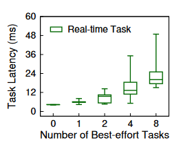

与操作系统使用抢占式调度来提供实时保证类似，一种直观的方法是为 GPU 调度提供抢占式，遗憾的是商用 GPU 中缺少这种功能。本文介绍了 REEF，这是第一个用于商用 GPU 的 DNN 推理服务系统，具有微秒级内核抢占和 GPU 调度中的受控并发执行，以实现实时性和工作节省。具体来说，到达的实时任务应立即从正在运行的尽力而为内核中抢占 GPU，而无需等待其完成。同时，应使用实时内核剩余的 GPU 资源来并发执行尽力而为内核。

### REEF的主要思想

* REEF 的一个关键见解是 DNN 推理中的每个内核大多是幂等的。这意味着正在运行的尽力而为内核可以主动终止并恢复，而无需保存上下文。（重复执行是没有副作用的）**基于此，REEF提出了基于复位的抢占方案。为了彻底刷新 GPU 运行时和设备中的数百个未完成的内核，REEF 设计了不同的方法来重置不同的软件队列，并对 GPU 驱动程序进行改造，以准确使用现有的硬件机制来重置计算单元**。因此，无论被抢占的内核数量及其执行时间如何，REEF 都可以在数十微秒内在 GPU 上启动实时任务。
* REEF 基于 DNN 推理中 GPU 内核的执行时间是确定性和可预测的观察结果，进一步提出了**动态内核填充机制**。这意味着可以根据提前的离线分析，仔细选择待处理的BE任务来填充实时内核，而不会干扰性能。
  + REEF 扩展了 GPU 编译器，通过使用函数指针构造填充内核的模板。此外，为了消除 GPU 上间接函数调用的开销，REEF 引入了代理内核来解决寄存器分配问题并避免运行时不必要的上下文保存。因此，REEF 可以同时执行实时任务和尽力而为任务，而代价是可以忽略不计的性能和内存开销（小于 1%，大约 10 KB）。

我们通过扩展 Apache TVM [73]（深度学习编译器）和 AMD ROCm [3]（开源 GPU 计算平台）来实现 REEF。我们使用具有不同工作负载和模型的新 DNN 推理服务基准 (DISB) 以及来自 Apollo [7]（开放式自动驾驶平台）的真实跟踪来评估 REEF。我们的实验结果表明，与将 GPU 专用于实时任务相比，REEF 只产生实时任务不到 2% 的端到端延迟开销，但总体吞吐量提高了 4.3 倍。与最先进的技术相比，我们的方法进一步将抢占延迟减少了一个数量级以上，所有模型的抢占延迟均小于 40 微秒。为了证明我们的方法在闭源 GPU 上的可行性，我们在 NVIDIA GPU 上进一步移植和评估了 REEF 的受限版本，将抢占延迟减少了 12.3 倍（从 6.3 倍）。

### contribution

* 深入了解 GPU 加速的 DNN 推理的特性（例如幂等性）和最先进的 GPU 调度方案的问题。
* 一种新的基于重置的抢占方案，无论被抢占的内核数量有多少，都可以在几微秒内启动 GPU 上的实时内核
* 一种优雅的机制，可以用尽力而为内核动态填充实时内核，以充分利用GPU 的大规模并行性
* 在 AMD 和 NVIDIA GPU 上的实施以及展示 REEF 相对于最先进技术的优势和功效的评估。

## 理论基础

### DNN特性

深度神经网络 (DNN) 包含多个多功能层实例，例如卷积层、池化层和全连接层。为了满足 GPU 上的推理请求，预先训练的 DNN 模型（例如 ResNet [30]）会提前加载到 GPU 内存中。图 2 概述了 GPU 加速的 DNN 推理的实现。对于每个到达的请求，DNN 的所有内核模型根据输入依次执行，结果输出返回到 DNN 应用程序。 DNN 推理现在被用于实时 (RT) 任务，例如障碍物和交通灯识别，以及尽力而为 (BE) 任务，例如情绪和疲劳监测。实时任务对延迟至关重要，因为违反端到端延迟要求可能会导致系统故障甚至安全问题。此外，此类请求通常由输入传感器以各种频率定期发出。相反，尽力而为任务没有硬性时序要求，而是在后台重复执行。

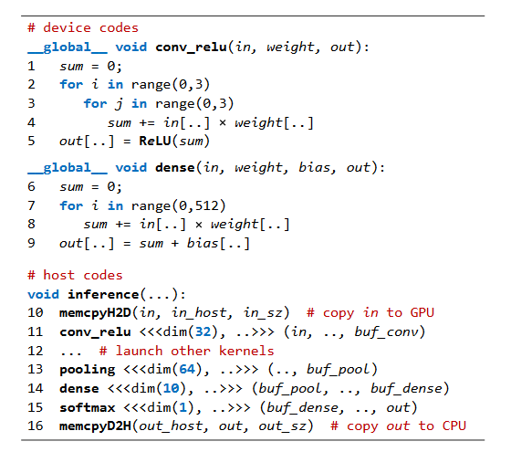

#### 幂等性

用于推理任务的 GPU 加速 DNN 模型由一系列内核组成，这些内核乎仅由密集的线性代数计算组成，没有副作用。因此，**无论是否重试，内核始终可以使用相同的输入产生相同的输出**。同时，在 DNN 模型中，第 (k) 个内核始终使用第 (k-1) 个内核的输出和静态参数（例如权重）作为输入，例如图 2 中的 conv\_relu 和稠密内核。因此，**DNN推理任务的执行可以从被中断的内核之前的任何内核恢复，并且不会改变推理结果**。

处理的数据也要回滚吧?不知道放在哪里.

#### 大量内核

现代 DNN 模型中常见数百个内核。因此，大量的内核（通常是数百个或更多）将被提前提交来隐藏冗长的内核启动时间。此外，为了充分利用 GPU，服务系统可以使用相同或不同的 DNN 模型同时执行来自不同推理任务的多个内核。因此，抢占 GPU 的性能损失将是巨大的（几毫秒），甚至可以与数百个内核的执行时间相媲美。

#### 可预测性

延迟可预测性。我们观察到，当在 GPU 上单独运行时（无干扰），DNN 推理中 GPU 内核的执行时间是确定性和可预测的。原因有两个。

* 首先，内核主要是线性代数计算，例如矩阵乘法和卷积，既不包含条件分支，也不包含不恒定循环。
* 其次，所有内核参数（例如输入和权重）和输出都是固定大小的数组。

因此，此类内核的执行时间与推理请求的输入无关，并且可以提前测量和准确预测。在实践中，我们观察到 DNN 模型的内核执行时间的方差通常只有几微秒而且非常正交。

#### 并行性

各种并行性。由于不同的输入规模，DNN 推理中的 GPU 内核通常表现出完全不同的并行性。例如，池化内核使用 64 个线程块，而 softmax 内核仅使用 1 个线程块。因此，DNN 推理的计算需求中需要的计算单元 (CU) 的数量，在执行过程中不断变化。因此，为了有效地利用 GPU，必须利用动态机制在运行时从不同的 DNN 推理任务中选择并执行多个内核。

### 现有GPU调度state-of-art

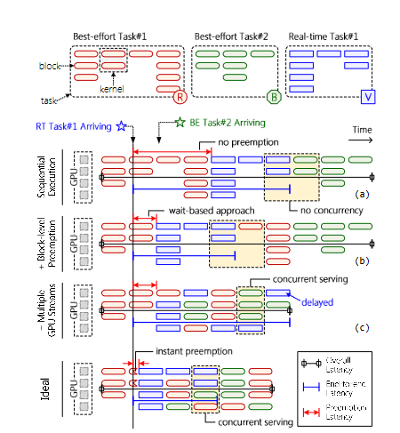

* a-被动等待\顺序执行:大多数现有的 DNN 服务系统都使用顺序执行来避免任务之间的干扰。然而，由于抢占延迟（红色尺寸线）过长，RT 任务的端到端延迟可能会显着延长，因为它必须等待先前任务的完成（无抢占）。此外，由于顺序服务推理任务（即无并发性），该方案的总体吞吐量较差。
* b-块级抢占:为了减少实时任务的端到端延迟，有必要抢占 GPU 运行尽力而为任务。然而，由于上下文较大（例如大量寄存器），很难在 GPU 上实现抢占式调度。同时，商用 GPU 也缺乏对抢占机制的硬件支持。先前的工作提出了基于等待的方法来实现 GPU 调度的块级抢占。实时任务仍然需要被动等待**运行块**完成。此外，抢占延迟将随着被抢占内核数量的增加而增加（见图1（c））。作为妥协，先前的工作 必须限制提交给 GPU 的内核数量，这对于 DNN 推理来说是不切实际的。此外，高频实时任务会破坏尽力而为任务的执行，甚至导致饥饿。
* c-流级并行:为了提高整体吞吐量，现代 GPU 库（例如 CUDA [52] 和 ROCm [3]）通常提供多个 GPU 流。运行时调度程序按需从 GPU 流调度内核，以保持所有计算单元 (CU) 繁忙。虽然利用多个 GPU 流可以提高吞吐量，但并发任务可能会显着降低实时任务的延迟，延迟开销也会随着并发任务数量的增加而增加。(没有赋予RT任务更高的优先级,增加了吞吐量牺牲了延迟)

## REEF结构

### 总结构

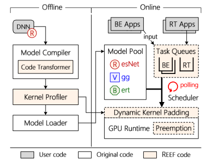

#### DNN 模型准备（离线）

通常，DNN 模型首先针对加速器后端（例如 GPU）进行编译和优化，然后加载到模型池中。受先前工作 [12,36,77] 的启发，REEF 使用代码转换器模块扩展了模型编译器（例如 TVM [15]），该模块首先**验证** DNN 模型中内核的幂等性，然后**转换**源代码以协助REEF 中的 GPU 调度。[how?]此外，REEF 开发了一个内核分析器来测量模型每个内核的计算要求和执行时间，这对于 DNN 模型来说是准确且实用的。

#### DNN推理服务(在线)

REEF 通过四个主要组件扩展了最先进的 GPU 运行时（例如 ROCm [3]），用于 DNN 推理服务。

* **Task Queue** REEF 维护一个实时任务队列和多个尽力而为Task Queue。每个队列都绑定到用于启动 GPU 内核的 GPU 流，其中推理请求按 FIFO 顺序提供服务。为简单起见，REEF 一次执行一个实时请求。请注意，任何将整个 GPU 视为单个设备的调度策略（例如 EDF [10]）都可以被 REEF 用于实时请求[应该是也能用的意思?]。此外，REEF 为基于 DNN 的应用程序提供基于 RPC 的接口，以向任务队列传递推理请求。
* **Scheduler** REEF 中的调度程序对任务队列使用繁忙轮询，并将任务分配给关联的 GPU 流。对应是否有实时任务，REEF提供了两种执行模式，即实时模式和普通模式。调度器遇到RT任务时会从普通模式切换到实时模式，当RT队列为空时又切换回普通模式。
* **preemption** 在正常模式下，REEF 使用 GPU 运行时提供的多个 GPU 流同时服务来自不同任务队列的尽力而为任务。在实时模式下，REEF 首先使用抢占模块立即从所有正在运行的尽力而为任务中抢占 GPU），然后立即在 GPU 上启动实时任务。
* **DKP**。在实时模式下，在启动实时内核之前，DKP 模块将选择适当的尽力而为内核并将它们动态填充到实时内核（§5）。 REEF 将在 GPU 上执行填充后的内核以实现高吞吐量。请注意，**best effort 内核将仅使用实时内核剩余的 GPU 资源**。

### 基于重置的抢占

#### 背景

DNN 模型中的 GPU 内核大多是幂等的，这使得主动抢占成为可能——立即杀死 GPU 上所有正在运行的内核并在稍后恢复它们。

* 首先，它避免保存和恢复 GPU 的大型上下文（例如，每个 CU 256 KB 寄存器文件)。
* 其次，无需等待所有正在运行的内核完成，这可能需要数百微秒。

  然而，在商用 GPU 上实现基于重置的抢占之前，仍然存在新的挑战。除了在 GPU 上运行的内核之外，数百个已启动的内核缓冲在由 GPU 运行时维护的多个队列中。这对于隐藏内核启动时间并充分利用 GPU 的大规模并行性是必要的。然而，需要逐出所有已启动的内核确实很难在数十微秒内抢占 GPU。

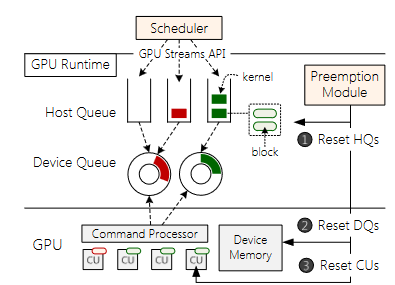

上图 说明了 GPU 运行时和设备中启动的**内核**的生命周期。首先，调度程序启动推理任务的所有内核，并为每个任务指定一个 GPU 流。 GPU运行时维护一个链表[谁和谁?]，称为**主机队列**，用于每个 GPU 流来缓冲启动的内核。每个主机队列都有一个后台线程，它将缓冲的内核异步传输到称为**设备队列**的环形缓冲区，CPU 和 GPU 同时访问该环形缓冲区。 GPU的命令处理器将轮询所有设备队列以获取缓冲的内核，并最终将它们分派到计算单元。因此，推理任务启动的内核可能存在于三个地方，即主机队列（HQ）、设备队列（DQ）和计算单元（CU）。为了实现即时抢占，必须驱逐所有三个地方的内核。

#### 驱逐缓冲区内核

基于重置的方法需要主动从主机队列和设备队列中逐出所有缓冲的内核。

对于主机队列，重置它们很简单，使所有缓冲内核出队并回收内存，因为它们完全由 GPU 运行时控制。

然而，对于设备队列，GPU 运行时无法从设备队列中逐出缓冲的内核，因为 GPU 的命令处理器可以直接从设备队列中获取内核，从而导致数据争用和不可预测的结果[一边拿一边放]。此外，CPU 也不提供从设备队列中安全驱逐内核的方法。

* 一个潜在的解决方案是通知GPU重新注册一个新的设备队列。然而，这会产生不可接受的延迟开销（例如，在我们的测试床上大约有 1 毫秒）。受可驱逐内核的启发，我们提出**延迟驱逐**来重置设备队列，而无需扩展 GPU 运行时间和硬件。 **REEF的代码转换器预先在每个内核的开头注入一段代码，通过检查抢占标志来判断是否已被驱逐。当抢占标志为真时，内核将自动终止。因此，当抢占发生时，抢占模块会立即将GPU内存中的抢占标志设置为true。设备队列中缓冲的内核将像往常一样被获取并分派到 CU，但会立即终止。**

我们的初始队列驱逐机制给抢占过程带来了不小的开销，抢占单个任务需要超过 500 μs。深入分析表明，开销主要来自（a）从主机队列回收内存和（b）等待从设备队列获取内核。因此，我们提出两种优化来减轻开销。

* 异步内存回收。当对主机队列中被逐出的内核使用同步内存回收时，抢占延迟与主机队列长度成正比。因此，抢占 DNN 推理任务的性能损失将是巨大的，因为它需要在主机队列中缓冲数百个内核。为了立即从主机队列中逐出 GPU 内核，REEF 利用**后台 GC 线程异步回收内存。**具体来说，REEF通过简单地先将头指针置空，然后通知GC线程在后台回收内存来重置主机队列。
* 设备队列容量限制。尽管使用延迟逐出可以在执行开始时立即终止设备队列中的内核，但仍然需要获取内核并将其分派到 CU，每个内核大约需要 20 μs。在设备队列中缓冲数百个内核是很常见的，因为它可以通过一次用来自主机队列的大量内核填充设备队列来减少上下文切换的频率。然而，它也可能将抢占延迟增加到甚至超过 1 ms。因此，REEF通过限制设备队列的容量来实现微秒级的内核抢占。**调整设备队列容量可以在抢占延迟和执行时间之间进行权衡。随着队列容量的减少，抢占延迟也会减少，因为需要驱逐的内核更少，但正常执行时间会增加，因为 GPU 有更多的空闲时间等待运行时用主机队列中的内核填充设备队列。**[用减少驱逐内核的方式牺牲运行时间减少内存驱逐的影响]我们根据经验在测试台上选择设备队列容量为 4，因为在 30 μs 内重置设备队列就足够了，而正常执行时间的开销可以忽略不计（即小于 0.3%）。此外，由于设备队列的填充更加频繁，使用较小的设备队列还会产生稍高的 CPU 利用率（例如，增加约 15%）。

#### 杀死正在运行的内核

为了避免等待正在运行的内核完成，基于重置的抢占会主动终止 GPU 中正在运行的内核。不幸的是，GPU 运行时提供的 API 和 GPU 驱动程序都没有提供可以从主机端终止正在运行的内核的功能。我们观察到 GPU 驱动程序能够终止 CPU 进程并杀死相关的 GPU 内核，即使内核陷入无限循环也是如此。这意味着 GPU 驱动程序确实可以杀死未完成的内核。但是，该函数也会回收进程和 GPU 内核分配的 GPU 内存。因此，被抢占的内核必须将 DNN 模型参数重新加载到 GPU 内存，甚至需要几秒钟的时间。

为了解决这个问题，**REEF改进了GPU驱动程序的内核杀死功能，并将其暴露给GPU运行时的抢占模块。新函数将指示命令处理器终止 CU 上所有正在运行的内核，但将其运行状态保留在 GPU 内存中**。在驱逐主机队列和设备队列后，抢占模块将使用它来杀死所有正在运行的内核。

#### 恢复抢占任务

尽力而为的任务应该在被抢占后恢复。一般来说，任务必须从头开始重新执行，并且假设没有副作用。幸运的是，DNN 模型中内核的幂等特性保证了 DNN 推理任务的执行可以从中断内核之前的任何内核恢复。这意味着调度程序可以安全地重新执行抢占的尽力而为任务。然而，这可能会产生严重的额外开销，因为 DNN 模型通常具有大量内核（通常为数百个或更多）。因此，将被抢占的任务从内核中恢复到中断位置附近非常重要。

不幸的是，精确识别中断的内核几乎是不可能的，因为运行在CU上的内核会被GPU的命令处理器直接杀死。为了解决这个问题，抢占模块在开始重置任务队列时首先记录最后一个传输到设备队列的内核（kl），然后从kl之前的c个内核中恢复被抢占的任务，其中c表示设备队列容量。[就算整个设备队列都是满的也能确保都是没有被运行过的,而且设备队列很小!!]我们观察到命令处理器顺序地从设备队列中获取内核并在 CU 上运行它。这意味着被中断的内核不会早于设备队列中最后一个内核（kl）之前的 c 个内核。此外，REEF 将冗余执行最多 c+1 个内核。**由于 c 配置得相对较小（即 4）**，因此恢复开销可以忽略不计（大约 30 μs）。

#### 抢占在闭源GPU上的效果

许多商用 GPU（例如 NVIDIA GPU）仍然是闭源的。这对我们基于重置的抢占方案提出了新的挑战，该方案必须将 GPU 运行时视为黑匣子。主要限制是我们无法重置 CU 来主动终止正在运行的内核。除此之外，REEF 还无法在 GPU 运行时之外直接操作主机队列和设备队列。但幸运的是，REEF 提出的用于重置 DQ 的延迟驱逐方案不需要对 GPU 运行时进行任何修改。

我们为闭源 GPU 提出了基于重置的抢占的受限版本，称为 REEF-N。 REEF-N 首先将每个 GPU 流（GPU 运行时提供的一般抽象）包装到虚拟主机队列 (vHQ) 中，该队列拦截并缓冲所有启动的内核。与 GPU 运行时内的（物理）HQ 类似，每个 vHQ 也有一个后台线程将缓冲内核异步传输到 GPU 运行时。**之后，REEF-N 将整个 GPU 运行时视为多个设备队列（每个 GPU 流一个）**[什么意思]，这样 REEF 可以轻松重置 vHQ 以逐出缓冲内核，而不是直接重置 HQ（如图 7 所示）。 REEF-N 仍然遵循延迟驱逐来重置 DQ，然后等待所有正在运行的内核完成。最后，为了模拟DQ容量限制，REEF限制了GPU运行时中未完成的内核的数量； vHQ 的后台线程在闭环中将固定数量的内核传输到 GPU 运行时。

### 动态内核填充

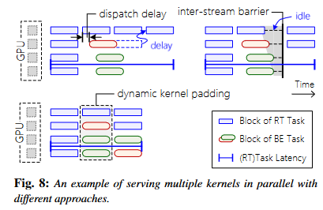

为了实现高吞吐量，实时任务和尽力而为任务应该在 GPU 上同时执行。但是，为了避免干扰实时任务，应仅使用实时任务剩余的 GPU 资源来服务尽力而为的任务。遗憾的是，现有的方法都无法在 GPU 上提供这种受控并发执行。

* 首先，使用不同的GPU流来启动实时且尽力而为的任务无法避免相互干扰。如上图所示，GPU 流之间的调度延迟 (20-40 μs) 可能会推迟实时内核的执行或限制它们的可用资源（例如 CU）。使用额外的流间屏障来同步 CU 之间的内核调度也会导致性能开销。
* 其次，静态内核融合可以在编译时将来自不同任务的多个内核合并为一个内核，然后使用单个流在 GPU 上启动融合内核。它可以提前避免实时任务和尽力而为任务之间的干扰。然而，静态内核融合必须预编译 DNN 模型中所有内核的所有可能组合，以便在运行时进行调度。如上所述，DNN 推理有数百个共同的内核，这使得静态内核融合不切实际。例如，仅考虑不超过三个内核的所有组合,它需要超过 35 GB 的 GPU 内存来存储表 1 中 DNN 模型的融合内核.

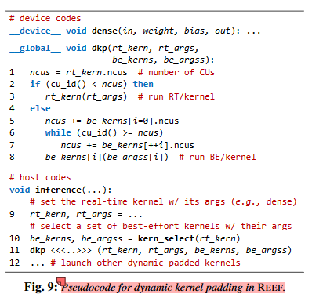

我们的方法：动态内核填充。受内核融合的启发，我们的方法还将实时内核和尽力而为内核合并为一个，并使用单个 GPU 流启动它，如图 8 所示。不同的是，我们在以下位置构建一个模板（称为 dkp 内核）：编译时并使用函数指针在运行时填充和执行内核。此外，我们动态选择尽力而为的内核以避免干扰实时内核。图 9 显示了用于动态内核填充的 dkp 内核 (dkp) 的示例，声明为全局函数（即内核条目）。候选内核函数（例如，dense）不是静态内联到 dkp 内核中，而是被声明为单独的设备函数，可以作为 dkp 内核参数传递并由函数指针调用（第 3 行和第 8 行）[??]。 dkp 内核对 CU 进行分区，以并行执行一个实时候选内核 (rt\_kern) 和一组尽力而为的候选内核 (be\_kerns)。它首先为实时内核分配足够的 CU（第 1-3 行），然后将剩余的 CU 分配给尽力而为内核（第 5-8 行）。当启动实时内核时，DKP 模块会选择适当的尽力而为内核与实时内核同时执行。

#### 高效的函数指针

如果没有特定的优化，由于 GPU 上函数指针的独特特性，我们的设计将降低实时内核的性能。我们总结了GPU上默认函数指针机制的两个关键性能问题。

* **有限的寄存器分配。**与 CPU 程序不同，GPU 程序需要不同但固定数量的寄存器，这些寄存器在编译时进行计数并编码到模型可执行文件中。而因为间接调用的函数使用的寄存器数量无法静态确定,这样的特性禁止在 GPU 内核中直接使用函数指针。 GPU编译器的默认行为是分配一个预定义的静态上限来限制被调用者的寄存器使用，这可能会由于寄存器不足而迫使被间接调用者将变量保存在堆栈上，从而导致与纯粹使用寄存器相比性能较差。
* **昂贵的上下文保存。** GPU 上的间接函数调用比 CPU 程序昂贵得多，因为在函数调用之前和之后需要保存和恢复大量的上下文（例如，数十个寄存器）。对于数千个线程，可能会保存和恢复 MB 大小的寄存器，从而引入大量开销。尽管编译器将内联[??]尽可能多的函数以避免这种开销，但无法内联通过函数指针的间接函数调用，这可能会对动态内核填充造成显着的性能损失。

  REEF 通过引入全局函数指针[所以谁是全局函数指针]来替代默认函数指针机制来解决上述两个问题。由于全局函数被视为内核条目，因此编译器既不应用寄存器限制，也不向它们添加上下文保存/恢复代码[不需要吗??]。因此，将候选内核声明为全局函数而不是设备函数可以解决这两个问题。根据我们的观察，候选内核中的上下文保存实际上是不必要的，因为 dkp 内核在调用 rt\_kern 或 be\_kerns[i] 后立即退出（见图 9）[为啥啊??]。因此，候选内核中缺少上下文保存代码不会影响执行的正确性。然而，作为内核入口，全局函数不能被另一个全局函数（例如，dkp内核）调用。为了绕过这个限制，我们用汇编代码中的跳转指令替换间接函数调用，并按照约定手动准备候选内核的初始状态[45]。这种方法不会对编译器进行任何更改，并且只会产生微不足道的函数调用开销（大约 1%）。[主要逻辑-寄存器上下文保存无法恢复+寄存器有静态上限->全局函数(因为候选内核不受编译器寄存器限制不需要进行上下文保存,调用后立即退出->全局函数不能被另一个全局函数调用->使用汇编的跳转指令替换函数调用(how??)并且手动准备候选内核的初始状态)]

其他的优化方法包括:

* 动态寄存器分配。应用全局函数指针技术后，由于存在过度分配问题，实时内核性能仍然不理想。为了满足候选内核不同的寄存器需求，**dkp内核必须分配尽可能多的寄存器（即过度分配），这可能会减少CU占用，从而增加执行时间**。[CU占用率意味着一个CU上可以同时执行多少个块。这取决于每个块需要多少资源（例如寄存器）。更高的 CU 占用率可以带来更好的性能。]一个直观的解决方案是在启动之前及时覆盖 dkp 内核的寄存器计数，使其适应选定的候选内核。不幸的是，内核的寄存器计数在离线阶段已随模型一起加载到 GPU 内存中，这意味着覆盖其值需要在每次内核执行之前进行 CPU 到 GPU 内存复制，严重影响执行性能.**为解决寄存器过度分配的问题,REEF引入一组代理内核**。代理内核与图 9 中的 dkp 内核共享相同的源代码，但分配不同数量的寄存器，允许调度程序根据每个候选内核的寄存器需求动态选择合适的代理内核。不幸的是**，为每个可能的寄存器计数生成代理内核面临着内核数量爆炸的问题**。例如，在每个线程最多有 128 个标量寄存器和 256 个向量寄存器的 AMD Instinct MI50 GPU 上，它将生成 32,768 个代理内核以覆盖所有可能的寄存器配置。**为了减少代理内核数量，我们生成代理内核来覆盖所有可能的 CU 占用而不是寄存器计数[二者有什么关系?没懂]。**由于引入代理内核是为了防止过度分配而减少 CU 占用率，因此具有不同寄存器数量但共享相同 CU 占用率的代理内核实际上是冗余的，可以合并在一起。更具体地说，我们使用的 AMD Instinct MI50 GPU 上有 10 个 CU 占用级别，对应 10 个寄存器计数范围，这使得我们只能生成 10 个代理内核，每个代理内核分配一个 CU 占用级别允许的最大寄存器数量。对于每个候选内核，调度程序都会选择分配寄存器最少的代理内核来满足候选内核的需求，从而实现尽可能高的 CU 占用率。这样，代理内核的数量从 32,768 个缩小到 10 个，而不会影响候选内核的性能。
* 动态共享内存。除了寄存器之外，共享内存的过度分配也可能会降低代理内核的 CU 占用率。幸运的是，内核可以通过在启动内核时设置一个属性（即“动态共享内存”）来动态分配共享内存。在模型编译过程中，REEF 将变量的声明从固定大小共享内存转换为动态共享内存（即在 **shared** 之前添加 extern）。因此，代理内核使用的共享内存量可以在运行时设置，具体取决于候选内核的最大需求。

#### 内核选择

对于动态内核填充，内核选择策略对于避免实时任务的延迟干扰非常重要，实时任务会从候选尽力而为内核中选择一组块[内核的粒度大于块?]，以便与到达的实时内核共享 GPU。 REEF 提出了一种贪婪启发式方法，以确保尽力而为的块将仅使用实时内核剩余的 GPU 资源（即 CU）。具体来说，它首先为实时内核预留足够的CU，然后检查尽力而为任务队列，为剩余的CU选择合适的块，直到没有空闲的CU或候选任务。所选的尽力而为块应满足以下两个规则。

* 规则1.尽力而为内核的执行时间必须比实时内核的执行时间短，因为dkp内核的执行时间是由最慢的块决定的。基于对 DNN 模型中 GPU 内核延迟可预测性的观察（参见第 2.1 节），我们开发了一个离线内核分析器来测量加载模型的每个内核的计算要求和执行时间。[BE不能耽误RT]
* 规则2.尽力而为内核的CU占用率必须高于实时内核的CU占用率，因为dkp内核的CU占用率是由最小内核决定的。请注意，内核的 CU 占用率可以直接从 DNN 模型的源代码中获得。[内核越小\占用率越高,这个目的是保证RT有更多寄存器?被分配到更大的内核?有必要吗]
* 内核选择策略完全满足将实时任务视为GPU上的一等公民的设计目标。它不仅高效，可以在不到 1 μs 的时间内选择尽力而为的内核，而且也很有效，将实时内核的延迟开销平均限制在 1% 以下。然而，该策略也是保守的，因此该约束可能会限制整体吞吐量的改进空间。例如，**当尽力而为内核的执行时间通常比实时内核长时，动态内核填充的吞吐量改进可能微不足道，即使RT任务仅使用几个 CU。**

## 实验部分

我们首先在 AMD GPU 上实现并部署 REEF，因为它的开源平台和 ISA [26, 54]，它可以充分展示基于重置的抢占和动态内核填充的功效。 REEF是通过扩展Apache TVM [73]和AMD ROCm [3]来实现的，大约有5,500行C++代码。除此之外，为了进一步展示 REEF 在闭源 GPU 上的可行性，我们还在带有 CUDA 的 NVIDIA GPU 上移植了 REEF-N（基于重置的抢占的受限版本）[52]。

模型编译器: REEF 通过代码转换器扩展了机器学习编译框架 Apache TVM [15]，主要对 DNN 推理的源代码添加了两处修改：（1）抢占标志，将其注入到内核参数中以延迟逐出内核; (2)一组代理内核，它是为内核填充而构建的。

GPU 运行时:

* 对于 AMD GPU，REEF 在 ROCm（一个便携式 GPU 运行时和编程库）的 HIP [63] 上构建了抢占模块。类似于 NVIDIA CUDA [52]。具体来说，REEF为GPU运行时添加了三个新的API：（1）hip\_reset\_hq，它重置主机队列并将USENIX协会第16届USENIX操作系统设计与实现研讨会54条命令移至GC线程； (2) hip\_set\_stream\_cap，限制一个GPU流使用的设备队列的容量； (3) hip\_reset\_kern，它通过Linux中的GPU驱动程序使用硬件机制重置计算单元[61]。
* 对于NVIDIA GPU，REEF-N拦截了与内核启动和流管理相关的三个CUDA API，并添加了以下操作：（1）cuStreamCreate，它创建vHQ并将其链接到创建的CUDA流； （2）cuKernelLaunch，它在vHQ中缓冲启动的内核并将其传输到后台的GPU运行时（即CUDA [52]）； (3) cuStreamSynchronize，等待GPU运行时完成CUDA流的所有启动内核。最后，REEF-N 提供了一个新的 API cuResetHQ，通过使所有缓冲内核出队来重置 vHQ。

### 实验基础

#### 测试条件

试验台。实验主要在 GPU 服务器上进行，该服务器由 1 个 Intel Core i7-10700 CPU（共 8 核）、16 GB DRAM 和 1 个 AMD Radeon Instinct MI50 GPU（60 个 CU 和 16GB 内存）组成。服务器的软件环境配置为ROCm 4.3.0 [3]、Apache TVM [73] 0.8.0和Ubuntu 18.04。硬件平台类似于自动驾驶汽车的计算资源 [4, 71]。我们使用安装了 CUDA 10.2 [52] 的同一服务器，在闭源 GPU（NVIDIA V100 GPU）上进一步评估 REEF-N，以证明我们方法的通用性。

#### 负载条件（DISB）

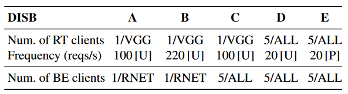

工作负载。受 YCSB的启发，我们构建了一个新的 DNN 推理服务基准（DISB），其中包含一套工具和五个工作负载：（A）低负载，（B）高 RT 负载，（C）高 BE 负载， (D) 多 RT 负载和 (E) 随机负载，如表 2所示。

DISB A–D 中的实时 (RT) 客户端统一以给定频率发送推理请求，这模拟了实时 DNN 应用程序自动驾驶（例如，使用摄像头进行障碍物识别），而 DISB E 中的客户端每秒发送 20 个具有泊松到达分布的请求，模拟事件驱动的实时 DNN 应用。请注意，对于 VGG 模型，每秒顺序服务 220 个 RT 请求将使我们的测试床饱和。另一方面，尽力而为（BE）客户端不断发出推理请求，模拟 GPU 上的争用负载（例如驱动程序监控）。 DISB 中部署了五个代表性的 DNN 模型，包括 ResNet-152 [30] (RNET)、DenseNet-201 [35] (DNET)、VGG-19 [68] (VGG)、Inception v3 [69] (IN3) 和DistilBert [66] (BERT)，全部由 Apache TVM [15] 生成。每个客户端总是提交针对某个 DNN 模型的推理请求。五类模型部署在5类DISB上。

此外，我们使用来自开放自动驾驶平台（即 Apollo）的真实世界轨迹作为实时工作负载，这提供了自动驾驶中实时任务的真实到达分布。我们从上述五个模型中选择了执行时间最接近的 DNN 模型来进行推理请求。同时，使用与 DISB C-E 相同的尽力而为的工作负载，其中五个客户端连续发出不同的 DNN 推理请求。

#### baseline

我们将 REEF 与典型的调度方法进行比较。 SEQ 通过被动任务抢占在 GPU 上顺序运行每个 DNN 推理任务，Clockwork [28] 采用了这种方式。具体来说，当队列中有多个任务等待时，它会优先考虑实时任务，但仍然需要等待已启动的besteffort任务完成。 GPUStreams 通过多个 GPU 流在同一 GPU 上同时运行实时任务和尽力而为任务，这一点被 TensorRT [50] 采用。作为参考，我们进一步提供 RT-Only，它代表实时任务的最佳端到端延迟，因为它将 GPU 专用于实时任务。

#### 执行结果

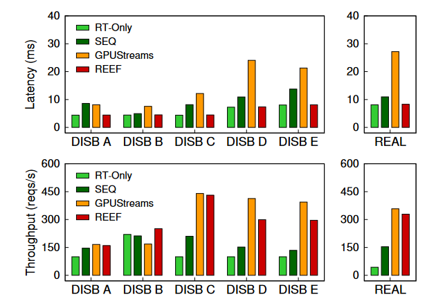

##### 单个BE（DSIB A/B)

对具有单个 BE 客户端的工作负载，使用 SEQ 或 GPUStreams 对性能的影响相对较低，因为尽力而为任务的 GPU 争用并不严重，无论是在等待时间 (SEQ) 还是并发干扰 (GPUStreams) 方面。对于DISB A，与 RT-Only 相比，**SEQ 和 GPUStreams 将整体吞吐量提高了 1.46 倍和 1.66 倍，但也将实时任务延迟分别放大了 1.95 倍和 1.84 倍。相比之下，REEF 在实时任务延迟方面产生的开销可以忽略不计 (0.5%)，但与 GPUStreams 相比，总体吞吐量提高了 1.60 倍。**

**对于 DISB B，由于运行实时任务更频繁，SEQ 的实时任务延迟降低了 1.12 倍，略好于 DISB A，因为它只需要等待**更少的尽力而为的任务。然而，它的吞吐量仅达到 RT-Only 的 96%，因为实时任务使 GPU 饱和，而尽力而为任务几乎没有机会运行。出于类似的原因，GPUStreams 的整体吞吐量也下降至 RT-Only 的 76%，而其实时任务延迟仍比 RT-only 高 1.70 倍。相反，得益于我们基于重置的内核抢占和动态内核填充，REEF 仍然可以将实时任务延迟的开销限制在 1%（约 60 μs），并在整体吞吐量上提供 1.14 倍的加速。

对于单个BE的的任务，SEQ和GPUStream为了延迟牺牲的吞吐量多，但Reef是一个均衡。

##### 多个BE（DSIB C/D/E)

多个 BE 客户端（DISB C、D 和 E）。随着尽力而为工作负载的增加，通过在两种类型的任务之间共享 GPU，所有方法的整体吞吐量比 RT-Only 都有不同程度的提高。然而，它们在实时任务延迟方面的表现却截然不同。 SEQ 和 GPUStream 在实时任务延迟和总体吞吐量之间做出了相同的权衡，只是性能影响的程度不同。对于三个工作负载，SEQ 将整体吞吐量提高了 1.34 倍至 2.10 倍，但也将实时任务延迟放大了 1.51 倍至 1.86 倍。对于 GPUStreams，上述数字变为 3.94× 至 8.19× 和 2.65× 至 3.31×。

不同的是，REEF 在不影响实时任务的前提下，尽可能提高整体吞吐量。因此，REEF 在所有工作负载中提供与 RT-Only 几乎相同的实时任务延迟，且开销不到 1.5%（0.1 毫秒）。对于总吞吐量，因为 VGG 很容易在大多数 DNN 模型被填充，REEF 在 DISB C 上提供了 GPUStreams 的接近结果。在 DISB D 和 E 上，REEF 的吞吐量比 GPUStreams 低约 25%，这是由于混合使用了五种 DNN 模型来执行实时任务，而 DKP 在少数RT和BE的任务组合上并不总是能很好地工作。然而，REEF 的性能仍分别优于 RT-Only 3.00 倍和 2.96 倍。

对于单个BE的的任务，SEQ和GPUStream为了吞吐量牺牲的延迟多（RT-ONLY都直接不管BE任务了），但Reef是一个均衡。

##### 真实世界

对于现实世界的工作负载，与 RT-Only 相比，SEQ 和 GPUStreams 将整体吞吐量提高了 3.6 倍和 8.3 倍，同时将实时任务的延迟分别放大了 1.35 倍和 3.35 倍。由于现实世界跟踪中实时任务的负载较低（大约 43 个请求/秒），REEF 大部分时间都保持在正常模式下并发执行尽力而为的任务，类似于 GPUStreams。因此，与 RT-Only 相比，REEF 实现了 7.7 倍的吞吐量提升，实时任务的延迟开销低于 2%，这要归功于我们基于重置的抢占，它可以在实时任务到达后的数十微秒内抢占 GPU。

#### DNN推理抢占结果

之前的工作 [12] 中提出的基于等待的抢占方法对于 DNN 推理服务来说并不实用，因为它只允许一项一项地执行任务。因此，我们通过取消启动内核数量的限制并实现延迟驱逐来扩展它以允许并发推理服务，并将该版本用作基线来演示我们基于重置的抢占的效率。

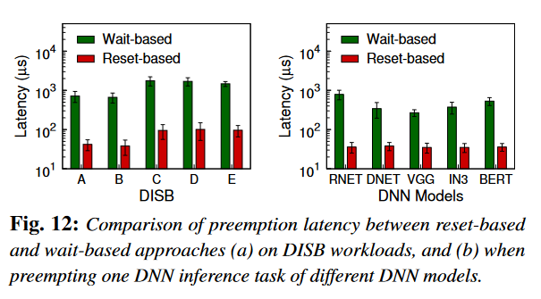

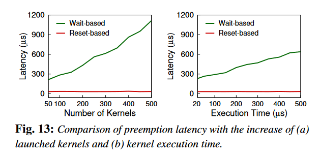

效果很好且对模型、内核数目不敏感。

##### 优化效果

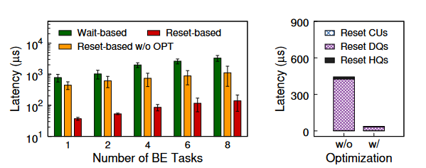

这两个图就是考虑不优化/拆解优化的情况。

我们对基于重置的抢占方法提出了两种优化，即异步内存回收和队列容量限制。为了演示优化的效果，图 14 显示了BE 发送端 (RNET) 增加后的抢占延迟，以及单个 BE 客户端的延迟细分。通过启用两项优化，抢占延迟显着下降高达 92%（从 87%），如图 14(a) 所示。即使不优化Reef也很棒。

由于这两种优化分别在重置主机和设备队列时使用，因此图 14（b）分解了抢占延迟以分别显示两种优化的贡献。对于单个BE客户端，使用异步内存回收将重置主机队列的延迟从17μs减少到3μs。同时，利用队列容量限制进一步将重置设备队列的延迟从424μs减少到31μs。请注意，使用命令处理器重置 CU 的速度非常快（小于 3 μs）。【看不出来，w/o是什么意思】

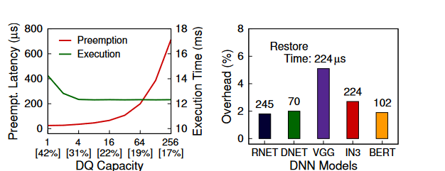

**队列容量选择。**我们限制设备队列容量，以减轻因延迟驱逐队列中剩余内核而产生的开销。但是，减少队列容量也会增加正常执行时间和 CPU 利用率。图 15(a) 显示当设备队列容量从1增加到4时，执行时间从14.3 ms减少到12.3 ms。然而，当容量进一步增加时，执行时间的变化变得微不足道（小于 0.3%）。相反，抢占延迟随着队列容量线性增加。因此，作为抢占延迟和正常执行时间之间的合理权衡，REEF在我们的测试平台上对设备队列采用了默认容量4，这对于正常执行来说几乎为零的开销，并提供了可接受的抢占性能（约30μs）。最后，使用较小的设备队列还会导致较高的 CPU 利用率【怎么算的】。例如，将队列容量从 256 个减少到 4 个，CPU 利用率从 17% 增加到 31%。

**任务恢复。**我们进一步评估由于任务恢复而被抢占的任务的执行时间开销。我们使用单个 BE 客户端发送推理请求；对于每个任务，我们随机抢占并恢复它。如图15（b）所示，所有DNN模型的恢复时间都很短，从70μs到245μs不等，这主要取决于DNN模型的内核执行时间（见图10）。请注意，由于队列容量限制，REEF 最多冗余执行 5 个内核来恢复抢占的任务。此外，除了 VGG (5.1%) 之外，所有 DNN 模型的执行时间开销约为 2%，因为它的内核最少 (55)，而且它的内核执行时间更长。【Overhead是占哪个的比】

#### 动态内核填充

为了研究动态内核填充的功效，我们使用高争用工作负载，其中一个 RT 客户端和一个 BE 客户端同时以足够高的频率发送请求以使 GPU 保持忙碌。 RT-Only 仅服务于实时任务，以确保最佳（实时）任务延迟，而 GPUStreams 同时服务于两种类型的请求，以实现最高的总体吞吐量。不同的是，动态内核填充也仅服务于实时任务，但会填充尽力而为的任务以避免饥饿并提高整体吞吐量。

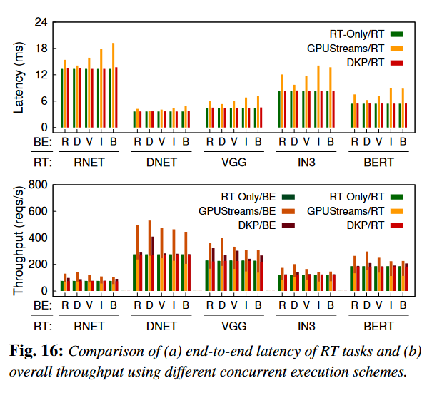

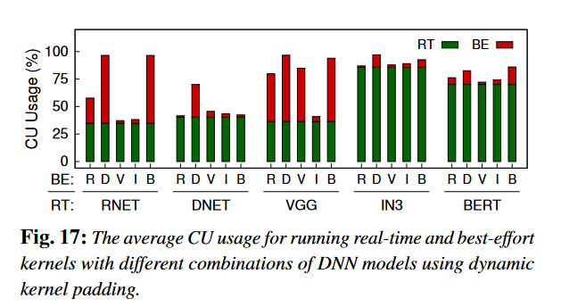

##### 结果

C55填充

图 16 报告了使用上述工作负载的五个 DNN 模型之间一对一组合的实验结果。正如预期的那样，由于并发尽力而为任务的严重干扰，GPUStreams 使实时任务延迟平均显着增加了 1.35 倍，范围从 1.04 倍到 1.70 倍。然而，REEF 能够为实时任务提供几乎最优的延迟，平均开销仅为 1%（最高 3%）。

对于 RT-Only，GPU 正忙于服务实时任务，因此尽力而为任务的吞吐量为零（即使 RT-Only 愿意服务它们）。虽然GPUStreams整体吞吐量平均提升1.52倍，但由于并发执行干扰严重，实时任务吞吐量平均下降24.4%。相反，REEF 首先保证实时任务的吞吐量，然后利用动态内核填充来提高整体吞吐量。

性能的提升主要取决于两个条件。首先，GPU上实时任务的执行还有改进的空间。如图 17 所示，IN3 和 BERT 中的实时内核平均分别使用 85% 和 70% 的 CU。【图17】因此，动态内核填充很难改善这种情况，平均仅增加 6%。请注意，GPUStreams 仍然可以提高它们的整体吞吐量，但也极大地牺牲了实时任务的性能。其次，尽力而为内核的执行时间必须比填充的实时内核的执行时间短。这解释了为什么REEF通过用RNET填充VGG可以实现很大的改（1.41×），但反之则不然，这也被图17中CU使用率（BE）的增加所证实。

##### 优化检验

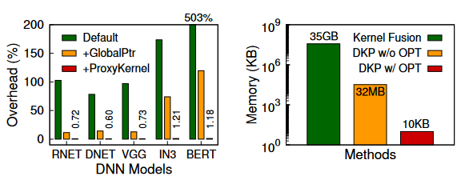

为了研究优化对性能和内存使用的影响，**我们首先使用 GPU 上函数指针的不同实现来评估开销**。我们通过 dkp 内核启动实时内核来测量此类开销，而不填充任何尽力而为的内核。如图 18(a) 所示，对于具有不同 DNN 模型的实时任务，默认函数指针实现（Default）会产生从 78% 到 503% 的执行时间开销。通过使用全局函数指针（GlobalPtr），开销平均显着降低至 46.4%（从 11.5% 降至 120%），因为它消除了设备函数指针寄存器数量的限制，并避免了额外的寄存器保存和恢复在函数调用期间。最后，通过使用代理内核（ProxyKernel），开销平均下降到0.8%（最多1.21%），它可以动态地为每个内核分配寄存器，并最大化CU占用。最小的开销来自CU分区的逻辑分支和全局函数指针的初始状态准备。

如图18（b）所示，使用静态内核融合（Kernel Fusion）需要超过35 GB的GPU内存来存储五个DNN模型的融合内核——所有组合不超过三个内核，甚至超出了内存容量大多数商品 GPU 的。 REEF 提出代理内核（DKP w/o OPT）以将 GPU 内存使用量减少到约 32 MB。最后，生成代理内核来覆盖所有可能的 CU 占用（DKP w/ OPT），而不是所有可能的寄存器配置，可以将 GPU 内存使用量大幅减少到仅 10 KB。

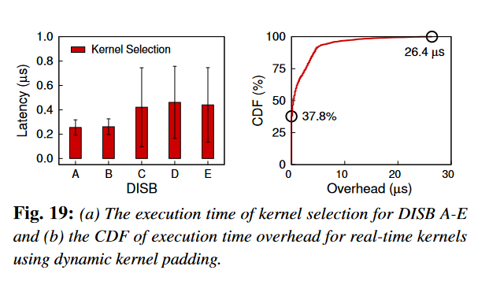

**内核选择。**图 19(a) 显示了动态内核填充期间 DISB A-E 的内核选择的平均时间。对于具有单个 BE 客户端（DISB A 和 B）的工作负载，REEF 需要大约 0.2 μs 来为给定的实时内核选择尽力而为的内核。对于具有多个 BE 客户端（DISB C、D 和 E）的工作负载，由于候选者增多，选择时间增加到 0.4 μs。一般来说，内核选择的成本相当微不足道，并且可以很容易地被内核执行隐藏。为了进一步研究内核选择的准确性，我们评估了由于在所有 DISB 工作负载上填充尽力而为内核而导致的实时内核的执行时间开销。如图19（b）所示，超过37％的实时内核没有受到尽力而为内核并发执行的负面影响，并且超过90％的实时内核的开销仍然小于4μs。执行时间的增加主要是由于GPU内存和共享L2缓存的争用。

#### 闭源GPU

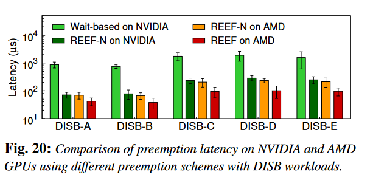

最后，我们评估 REEF-N，这是在 NVIDIA 和 AMD GPU 上使用 DISB 工作负载的基于重置的抢占的受限版本，并将其分别与基于等待的方法和 REEF 进行比较。如图 20 所示，即使 REEF-N 不重置 CU 来主动终止正在运行的内核，抢占延迟也仅为 71μs 至 288μs，这仍然比基于等待的方法高出 12.3 倍（从 6.3 倍）在 NVIDIA GPU 上。通过比较 AMD GPU 上的 REEF-N 和 REEF，我们观察到主动终止正在运行的内核进一步有助于抢占延迟平均加速 2.0 倍，特别是对于抢占并发任务（例如 DISB C 为 2.3 倍）。此外，REEF-N 在两个 GPU 上的性能接近。

### 研究不足

#### 幂等性假设

REEF 中基于重置的抢占基于 DNN 推理中的每个内核应该是幂等的假设。目前，我们遇到的所有 DNN 推理内核（来自 11 个模型 [72] 的总共 320 个内核）都被证明是幂等的。然而，读者可能会对我们的方法是否仍然适用于没有幂等假设的内核感兴趣。严格来说，基于重置的抢占要求内核始终为相同的输入产生相同的输出，无论是否已重试。因此，如有必要，可以使用事务化方法将非幂等内核转换为幂等内核。

此外，由于在 REEF 中只有尽力而为的内核可以被抢占，因此这种转换只会牺牲转换后的内核（即尽力而为的内核）的性能，以确保实时内核可以在到达时立即执行，而不会造成性能损失。我们将这项技术的结合留到未来的工作中，直到我们真正遇到非幂等 DNN 内核。

#### 对内核选择的限制。

当前的内核选择策略是有效但保守的，因为 REEF 的主要目标是避免对实时任务的性能干扰。一个明显的限制是尽力而为内核的执行时间必须比填充的实时内核的执行时间短，这限制了整体吞吐量的改进空间。我们发现，通过在模型编译期间使用更多线程块，可以对 GPU 内核进行定制，以缩短每个块的执行时间。例如，Apache TVM 自动调整线程块的数量以提高整体性能，但也允许开发人员对其进行自定义[38]。目前，REEF 整体吞吐量的提高很大程度上归功于启用即时内核抢占，它允许空闲的 GPU 执行尽力而为的任务。因此，我们将其留给未来的工作来克服内核选择的限制。此外，该策略没有考虑实时内核和尽力而为内核之间的 GPU 内存争用，因为它仍然足以运行多个 DNN 推理任务。我们也把它留给未来的工作。

#### 未来的GPU API和运行时

我们为未来的GPU提供了设计借鉴：使用单独的 GPU API 来精确重置 CU 是可行的，并且对于终止和恢复所有正在运行的内核很有用。其次，我们提出了一个新的 GPU API，它指示命令处理器丢弃获取的内核并停止从设备队列 (DQ) 获取更多内核。基于此，DQ 可以通过软硬件协同设计主动重置，取代我们的纯软件解决方案（即延迟驱逐）。最后，GPU 运行时可以为开发人员提供高级 API 来重置 GPU 流，方法是丢弃内部数据结构（例如主机队列）中缓冲的内核并通过两个新 API 重置 GPU。我们相信这些扩展可以大大简化实现，甚至在闭源GPU上完全实现基于复位的抢占，并进一步提高性能，例如在10 μs内立即抢占GPU。

### 有关任务

#### DNN 推理服务系统。

现有模型服务系统主要关注于满足服务级别目标（SLO），通常在数十毫秒内，并提高数据中心应用程序的整体吞吐量。 Clockwork [28] 利用 DNN 推理的延迟可预测性来实现低尾部延迟。它在专用 GPU 上顺序运行推理以提供可预测的性能。 Clipper [20] 和 Nexus [67] 支持在同一模型上进行批处理推理，以提高 GPU 利用率和推理吞吐量。 Abacus [22] 通过准确预测重叠算子的延迟来实现同步 DNN 推理。 INFaaS [64] 可以为每个推理自动选择具有不同优化的正确变体，以满足不同的 SLO。然而，**数据中心应用程序的延迟 SLO 比实时系统的延迟 SLO 宽松得多，例如其单独运行延迟的 2 倍 [22]。因此，使用非抢占式调度或批处理方案对于数据中心应用程序有效，但对于实时场景（例如自动驾驶车辆）则无效**。此外，REEF的设计与上述分布式服务系统是正交的。 REEF 中的两个关键机制也可以集成到其中，以提高每个 GPU 的吞吐量并保持实时推理的低延迟。

GPU 内核抢占。除了软件抢占技术之外，先前的工作还提出了硬件增强来支持抢占式 GPU 调度[44,56,70]。一个直观的解决方案是支持 GPU 上的上下文切换 [70]。然而，由于上下文较大（例如，大量寄存器），GPU 上的成本远高于 CPU。珍等人。[44]提出了轻量级上下文切换以避免不必要的寄存器节省。塔纳西 ́ c 等人。 [70]扩展了硬件，通过停止发出新的线程块来被动抢占 GPU 的流式多处理器（SM）。 Chimera [56]进一步提出了SM刷新，以在检测到幂等执行时立即抢占SM。不同的是，我们的方法改进了现有的硬件机制，不需要对 GPU 进行修改即可实现即时抢占。

GPU 多任务处理。人们已经做出了许多努力来同时执行多个 GPU 内核以实现高吞吐量 [27,43,55,57,74,76]。对于 DNN 计算，Rammer [47] 采用整体方法在编译时利用内核间和内核内并行性，它使用静态内核融合 [74] 来强制并发内核的 CU 分配。然而，静态内核融合要求融合内核在编译时已知，这不适用于REEF中的动态任务调度。R EEF提出动态内核填充以允许在运行时做出调度决策。先前的工作还提出了建模和预测并发内核执行速度减慢的方法[13,14,86,88]。 DASE [34] 对并发内核的内存争用进行建模。 Themis [87]使用神经网络来预测性能干扰。该预测可以帮助做出调度决策，以满足实时内核的延迟要求。然而，预测并不总是准确的，减速确实发生了。不同的是，REEF 中的动态内核填充强制并发内核仅使用实时内核剩余的 GPU 资源。目前，REEF主要关注GPU计算资源（即CU），并假设其他资源充足（例如GPU内存和带宽）。我们把它留作未来的工作。

### 结论

本文介绍了 REEF，这是第一个适用于商用 GPU 的 DNN 推理服务系统。它可以在GPU调度中实现微秒级的内核抢占和受控并发执行。首先，REEF 可以通过在微秒级主动终止和恢复尽力而为的内核，在 GPU 上启动实时内核。其次，REEF 可以使用适当的尽力而为内核动态填充实时内核，从而以可忽略的开销充分利用 GPU。此外，我们还为 DNN 推理服务构建了一个新的基准 (DISB)，其中包含不同的工作负载和真实世界的跟踪。使用 DISB 和微基准测试进行的评估证实了 REEF 在 AMD 和 NVIDIA GPU 上的功效和效率。

## 知识

### 静态内核融合

### 忘掉的C++知识

内联函数

### 内核\流\CU占用和寄存器数量

### 动态共享内存(什么过度分配?没懂)
