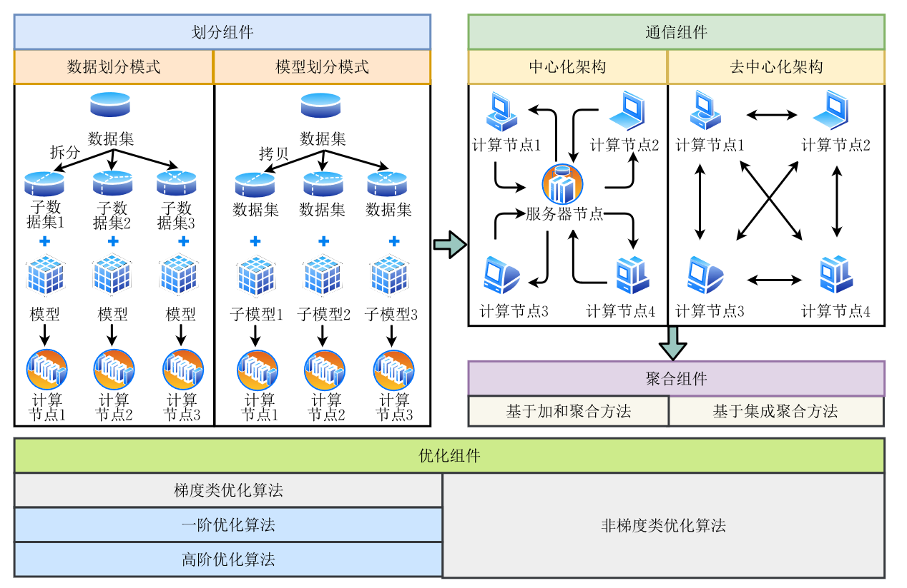

# 计算机网络论文笔记

发布时间：2024-11-20  
最后更新：2025-03-04  
归档主题：课程与分布式学习  
原文：https://sysufyj.github.io/2024/11/20/%E8%AE%A1%E7%AE%97%E6%9C%BA%E7%BD%91%E7%BB%9C%E8%AE%BA%E6%96%87%E7%AC%94%E8%AE%B0/

> 从网页恢复的阅读副本；非 Hexo 原始 Markdown。

# 论文1-中文综述

摘要：人工智能利用各种优化技术从海量训练样本中学习关键特征或知识，以提较高的质量量，这对训练训练方法提出了更高的要求。然而，传统单机训练无法满足存储与计算性因此，利用多个计算节点协同的分布式训练系统成为热点研究方向之一。本文首先阐述了单机训练面临的主要挑战。其次、分解析了分布训练系统系统预急需解决的三个关键问题（**分区、通信、聚合**），基于上述问题总结了一套训练系统的通用框架与四个核心组件。在此基础上，总结了基于随机随机陡峭下降算法的中心化与去中心化架构构研分支，并对各研研分支优化算法与应用进行综述.最后,提出了未来可能的研究方向.

## 概论

划分组件负责数据或模型的拆分任务，并将拆分后的子数据集或子模型部署到相应计算节点．优化组件提供各类优化算法供各计算节点调用．通信组件负责各计算节点间数据传输与信息同步．聚合组件负责将各计算节点产生的中间训练结果进行聚合 ，并输出训练任务的全局解 ．上述四个组件各司其职 ，协同完成训练任务.

## 划分组件

数据并行、模型并行、混合并行（和网络关系不大）

### 通信组件

分布式训练系统与传统单机训练的最主要差别在于利用多个计算节点间的协同合作加速完成训练任务,因此通信成为分布式训练系统不可或缺的环节.然而,由于硬件设备、网络带宽和传输速率等因素的影响,分布式训练系统计算节点间的通信往往成为瓶颈,严重制约了训练性能.在这种情况下,通信组件试图设计合理、高效的通信机制,减少通信开销.通信机制不仅要考虑硬件系统层面的限制约束还要兼顾软件算法层面的优化问题.本小节将从**通信内容、通信拓扑以及通信同步方式**三个方面介绍分布式训练系统的通信组件

* 通信内容：和并行模式有关，数据并行通信内容包括模型参数及更新，模型并行分布内容为中间结果。主要研究包括对通信内容量化压缩、稀疏化压缩、低秩分解等压缩算法以及神经网络的参数选择算法。
* 通信拓扑：包括物理拓扑和逻辑拓扑，这篇主要讨论物理拓扑。包括中心化架构、去中心化架构（包括All-reduce机制和Gossip机制）
* 通信同步方式：单/多线程同步、异步算法。
* 协议/算法

### 优化组件

和网络无关，主要介绍使用人工智能的优化组件。

### 聚合组件

基于加和/集成获取最终结果，和网络也没什么关系。

## 并行优化算法

### 随机梯度下降算法

略

### 中心化架构算法

* 同步算法：梯度在各个服务器节点上的分布
* 异步算法：中各计算节点完成当 前轮次迭代训练后无需等待其它计算节点，因而提升了计算资源的利用率【文献[107]提出了一种新类型中心化训练算法ALADDIN.该算法在服务器节点与计算节点之间采用非便捷通信方式，解决服务器节点的通信瓶颈问题.ALADDIN算法设计了新型PS触发本地参数更新策略及Lazy全局参数更新策略，以缓解方差增加的问题。通过收敛性该算法在非凸目标函数下具有线性加速比.此外,5 1 1期王恩东等:环球训练系统及其优化算法综针对延时同步并行 SSP 算法静态阈值设置难题，文献[108]提出了一种自适应动态同步阈值算法 (DynamicStaleSynchronousParallel,DSSP). 算法在运行时自适应地调整各次迭代的同步阈值，以减少速度较快计算节点对全局模型参数同步的等待时间，从增加迭代吞吐量并加快收精简】
* 非/共享内存的分布式异步算法：【文献[109]在非共享内存条件下研究了“星状”网络拓扑（中心化架构）的异步更新策略，并提出了AsySGCON算法】

### 去中心化架构算法

在中心化架构架构中，中心节点的通信拥塞问题将随着计算节点数量的增加而愈发严重。不一样的的是，去中心化架构算法依赖于计算节点之间复杂的通信机制造以规避中心化架构中的通信拥塞.去中心化架结构算法按照通信方式可解读为同步算法和异步算法。

主要是参数在节点之间的通信。

## 分布式训练优化算法

### 面向异构环境

由于计算备现呈现出多样化发展态势，研究所员逐步探索并研究了环境下的多元化训练策略[120122]。 文献[120]提出了一个异构感知的去中心化分布式训练方法。

### 面向联邦学习

### 面向大模型

感觉是内存方面的。

# 论文2-A Survey on Distributed Machine Learning

## 常见用于人工智能的分布式框架介绍

Apache Spark [168, 169] 等流行框架抓住了机器学习成为新兴工作负载的机会，现在提供优化的库（例如 MLlib [98]）。另一方面，最初设计为在单台机器上运行的专用机器学习库已开始获得在分布式环境中执行的支持。例如，流行的库 Keras [35] 接收到在 Google 的 Tensorflow [1] 和 Microsoft 的 CNTK [129] 上运行的后端。 Nvidia 通过集体通信库 (NCCL) [106] 扩展了他们的机器学习堆栈，该库最初设计用于支持同一台机器上的多个 GPU，但版本 2 引入了在多个节点上运行的能力 [76]。该生态系统的中心（图 4）是为分布式机器学习而原生构建的系统，并围绕特定算法和操作模型进行设计，例如分布式集成学习、并行同步随机梯度下降 (SGD) 或参数服务器。

## 本地分布式机器学习系统

分布式集成学习，各种并行【学习】策略，不涉及底层网络架构和通信，但可能涉及组件组成的抽象网络。

**百度**在此过程中包含了 Patarasuk 和 Yuan [118] 的进一步优化，称为 Ring AllReduce，以减少所需的通信量。通过将机器集群构建为环（每个节点只有两个邻居）并级联归约操作，可以最佳地利用所有带宽。那么，瓶颈就是相邻节点之间的最高延迟。百度声称在应用该技术训练深度学习网络时可以实现线性加速。然而，它仅在相对较小的集群上进行了演示（每个节点有五个节点，尽管每个节点都有多个 GPU，通过同一系统相互通信）。默认情况下，该方法缺乏容错能力，因为环中的任何节点都不会被遗漏。这可以通过冗余来抵消（以效率为代价）。然而，如果不这样做，则该方法的可扩展性受到所有节点可用的概率的限制。当使用大量商用机器和网络时，这种概率可能很低，而这是促进大数据发展所必需的。百度的系统已集成到 Tensorflow 中，作为基于内置参数服务器的方法（如下所述）的替代方案。

**Horovod** [131]采用了与百度非常相似的方法：它向 Tensorflow 添加了一层基于 AllReduce 的 MPI 训练。一个区别是，Horovod 使用 NVIDIA 集体通信库 (NCCL) 来提高在 (Nvidia) GPU 上训练时的效率。这还允许在单个节点上使用多个 GPU。对现有 Tensorflow 模型进行数据并行化相对简单，因为只需要添加几行代码，将默认的 Tensorflow 训练例程包装在分布式 AllReduce 操作中。当使用 128 个 GPU 对 Inception v4 [148] 和 ResNet-101 [68] 进行基准测试时，平均 GPU 利用率约为 88%，而 Tensorflow 参数服务器方法中的平均 GPU 利用率约为 50%。然而，Horovod 缺乏容错能力（就像百度的方法一样），因此遇到了同样的可扩展性问题 [53]。

……etc 如何通过reduce方法减少延迟

一些算法优化……

# A Survey on Trusted Distributed Artificial Intelligence

新兴的人工智能 (AI) 系统正在彻底改变计算和数据处理方法，对社会产生巨大影响。数据通过自动标记管道进行处理，而不是将其作为系统的输入提供。创新性提高了监控/检测/反应机制的整体性能，以实现高效的系统资源管理。然而，由于硬件驱动的设计限制，网络和信任机制不够灵活和自适应，无法动态交互和控制资源。新颖的自适应软件驱动设计方法可以使我们通过虚拟化具有最大化功能的网络功能来构建具有软件定义网络（SDN）功能的不断增长的智能机制。这些挑战和关键功能集已被确定，并以其人工智能系统的科学背景和不断发展的智能机制引入到本次调查中。此外，还探讨和讨论了 1950-2021 年间的障碍和研究挑战，重点关注近年来的情况。这些挑战根据新兴可信分布式人工智能机制的三个定义的架构视角（集中式、分散式/自主式、分布式/混合式）进行分类。因此，可以通过端到端可信执行环境（TEE）在动态环境中确保弹性和稳健性，以促进智能机制和系统的发展。此外，正如论文中所提出的，基于可信分布式人工智能（TDAI）的信任测量、量化和证明方法可以应用于新兴的分布式系统及其底层的多样化应用领域，这将在我们未来的相关领域中进行探索和实验。

【看不懂，但是是偏狭义的网络，以及一个基于人工智能的分布式网络设计……】
