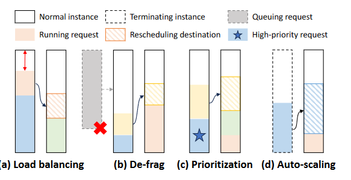
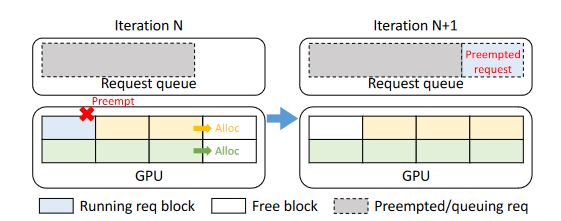
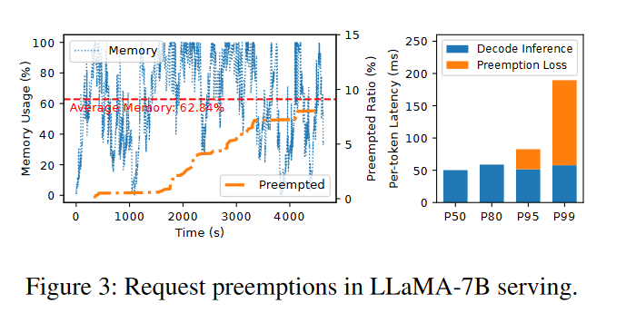
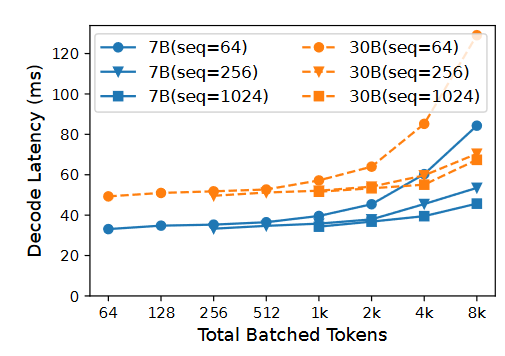
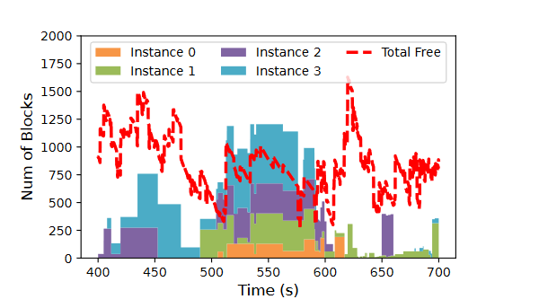
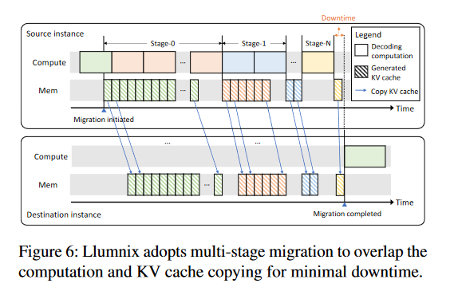
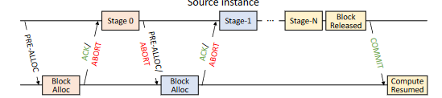
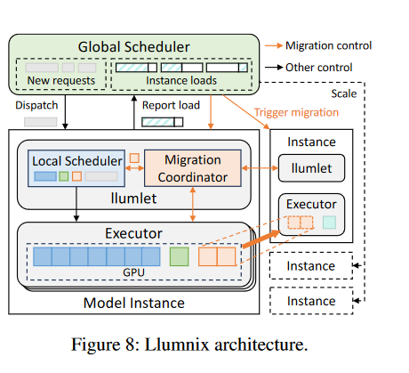

# Llumnix: Dynamic Scheduling for Large Language Model Serving论文笔记

发布时间：2024-12-09  
最后更新：2025-03-04  
归档主题：大模型服务与参数调优  
原文：https://sysufyj.github.io/2024/12/09/Llumnix-Dynamic-Scheduling-for-Large-Language-Model-Serving%E8%AE%BA%E6%96%87%E7%AC%94%E8%AE%B0/

> 从网页恢复的阅读副本；非 Hexo 原始 Markdown。

为大型语言模型 (LLM) 提供推理服务是在人们的日常生活中释放其潜力的关键。然而，LLM大规模推理服务在今天仍然具有挑战性，因为由于应用程序的多样化和LLM的动态执行性质：请求本质上是异构的，并且在资源和延迟要求方面是不可预测的。现有系统在处理这些特征方面从根本上受到限制，并导致严重的排队延迟、尾部延迟差和 SLO 违规等问题。

我们引入了 Llumnix，这是一个 LLM 服务系统，它通过跨多个模型实例的运行时重新调度来响应此类异构且不可预测的请求。与现代操作系统中跨 CPU 内核的上下文切换类似，Llumnix 重新安排请求以改善负载平衡和隔离、减少资源碎片并区分请求优先级和 SLO。 Llumnix 通过高效且可扩展的实时迁移机制来实现请求及其内存状态的重新调度，并在动态调度策略中利用它，优雅地统一了多种重新调度场景。我们的评估表明，与最先进的 LLM 服务系统相比，Llumnix 将尾部延迟提高了一个数量级，将高优先级请求加速高达 1.5 倍，并在实现类似尾部延迟的同时节省高达 36% 的成本。 Llumnix 已在 <https://github.com/AlibabaPAI/llumnix> 上公开提供。

## 引入

大语言模型本身的性质：

* 工作负载异构性：不同推理请求的长度、预期延迟都是不一致的。
* 执行不可预测性：不像DNN，对于类似服务，LLM生成的token的多少、执行时间和资源需求都是不可预测的。

这些特征标志着LLM本质上一个多租户和动态环境，与可预测和稳定的DNN不同，我们发现法学硕士更类似于现代操作系统托管进程，具有动态工作集和多核上的不同优先级。现有的推理系统专注于最大化单个实例中的吞吐量的唯一目标，跨实例的请求调度受到的关注相对较少；如今的常见做法仍然是使用从传统 DNN 时代继承的通用调度系统或策略。如此明显的差距在以下对于多租户环境和在线服务至关重要的方面带来了挑战：

* 隔离性：内存争用导致性能干扰，导致高度不稳定的延迟和SLO违规。
* 碎片化：不同长度和内存需求的请求会导致实例之间的内存碎片，对正在运行的请求的负载均衡会跨实例分配空闲内存空间，导致碎片以及较长的排队延迟。
* 优先级：不同请求有不同延迟目标，因此需要区分优先级。

我们引入了 Llumnix，这是一种用于 LLM 服务的新调度系统，它通过跨模型实例的请求的运行时重新调度来解决上述挑战。类似于操作系统进程管理中跨 CPU 内核的上下文切换，重新调度使 Llumnix 能够在运行时对不可预测的工作负载动态做出反应，而不必通过一次性分派请求来解决所有复杂的调度问题和权衡。

Llumnix 出于多种目的重新安排请求：用于减少抢占和干扰的负载平衡、用于减轻排队延迟的碎片整理、通过创建更高程度的隔离来确定紧急请求的优先级、在自动扩展期间更快地饱和或耗尽实例。

Llumnix 通过高效且可扩展的实时迁移机制重新安排请求以及跨实例的 GPU 内存状态。直接的调度可能会给重新安排的请求会加强尤其是长序列的延迟。相比之下，Llumnix 通过仔细协调计算和内存传输来隐藏成本，引入了接近于零的停机时间，停机时间与序列长度无关。

为了利用迁移所带来的极大调度灵活性，Llumnix 采用了一种分布式调度架构，使得能够实现具有高度可扩展性的持续重调度。在此架构下，Llumnix 进一步引入了一种动态调度策略，以优雅的方式统一了具有不同目标的所有重调度场景。 这种统一通过一个名为“虚拟使用量”（virtual usage）的概念实现：Llumnix 只需要为不同场景中的请求定义一组设置 GPU 内存虚拟使用量的规则，然后基于这些虚拟使用量使用一个简单的负载均衡策略即可。

我们将 Llumnix 实现为推理引擎之上的调度层。 Llumnix 目前支持一个代表性系统 vLLM [34] 作为底层引擎。使用实际工作负载对 16-GPU 集群进行的评估表明，与最先进的调度程序 INFaaS 相比，Llumnix 将 P99 第一个令牌延迟降低了 15 倍，将 P99 每个令牌生成延迟降低了 2 倍 [ 53]。 Llumnix 还将高优先级请求加速了 1.5 倍，并在提供类似尾部延迟时节省了 36% 的成本。

* 我们揭示了大语言模型（LLM）服务中的独特特性和调度挑战，这些挑战需要新的调度目标，例如隔离、碎片整理和优先级管理。
* 我们提出将请求重调度作为实现这些目标的关键措施，并通过一种高效的请求及其 GPU 内存状态迁移机制加以实现。
* 我们设计了一种分布式调度架构及其配套的调度策略，利用请求迁移以统一的方式实现多个调度目标。
* 我们实现并评估了 Llumnix，展示了其相较于当前最先进推理服务系统的优势。

## 背景

大语言模型的多样性：随着GPT提示学习与微调的思想，任务种类变得多样化，因而服务需求也变得多样化：主要包括序列长度和预期延迟两个方面。

**自回归：**最先进的 LLM 的推理是自回归的：模型迭代地接受输入序列加上所有先前的输出标记以生成下一个输出标记，直到生成“序列结束”（EOS）标记。生成第一个令牌的阶段和随后生成每个新令牌的阶段通常分别称为预填充和解码。 LLM 服务通常以流方式返回生成的令牌。因此，**预填充和解码延迟**都是用户可感知的，并且对用户体验很重要。预填充延迟决定了开始接收响应所需的时间，这可以由排队延迟决定。解码延迟决定了随后接收后续令牌的速度。中间结果对于每个令牌都参与所有后续令牌的生成。因此，推理引擎通常将这些状态存储在 GPU 内存中以供重用，称为 KV 缓存 。

**批处理和内存管理：**最先进的推理引擎应用连续批处理技术来处理不同的序列长度和动态到达的请求。也就是说，新的/已完成的请求可以立即加入/离开正在运行的批处理，而不是等待所有正在运行的请求完成。批处理还引发了对 KV 缓存内存管理的担忧。

由于KV缓存的内存需求是未知的，如果内存被保留到最大长度，那么它会明显限制批大小和批处理的好处。例如，LLaMA-213B [58] 模型支持高达 4k 的序列长度，这相当于单个请求的 3.2 GB KV 缓存；而当前 GPU 的内存仍然是数十 GB，更不用说模型权重的空间了（LLaMA-2-13B 为 26 GB）。因此，最近的工作（vLLM [34]）提出了 KV 缓存的动态内存分配，以增加批量大小和吞吐量，这通过一种名为 PagedAttention 的技术来实现：随着 KV 缓存的增长，KV 缓存张量存储在动态分配的块中。图 2 展示了使用连续批处理和动态内存分配的示例。运行的请求是根据空闲内存块来选择的，因此在第 N 次迭代时会出现一个排队请求（灰色的），因为内存不足。在下一次迭代中，系统将耗尽内存来容纳正在运行的请求的新块。因此，系统会抢占某些正在运行的请求（蓝色请求），然后该请求返回队列。

## MOtivation

* 不可预测的内存需求和抢占。在动态内存分配中，由于内存需求不可预测，请求抢占是不可避免的，这会显着增加被抢占请求的延迟。

* 由于 GPU 计算和内存带宽资源上的资源竞争，批量请求之间存在着性能干扰。

  
* 内存碎片：考虑到上述问题，最好将请求分散到实例之间，以减少抢占和干扰。然而，这种分散会使集群的可用内存同时在多个实例之间产生碎片。像 PagedAttention [34] 这样的动态分配技术可以在解码阶段消除外部碎片，在解码阶段一次分配一个块。然而，外部碎片仍然是预填充阶段的一个重要问题，这需要一次分配中实例上的许多块来容纳输入中所有令牌的 KV 缓存。因此，外部碎片会导致新请求的排队延迟较长。

* 请求具有不同紧急情况和优先级

上述motivation导向的功能：请求跨实例重新安排。本文探讨了当前 LLM 服务系统中缺失的一个新维度：部署的多个模型实例【实例是啥意思】及其交互。一个简单的直觉是，当某个实例出现上述问题时，整个集群仍然有足够的空间来避免抢占请求、容纳新请求或减轻干扰。这也是跨实例的不同请求长度和内存负载的自然结果。然而，现有系统无法利用其他实例上的此类可用空间，因为一旦在整个自回归执行过程中进行调度，请求就会绑定在同一实例上。 Llumnix 统一了请求调度组件和模型推理引擎，以探索推理实例之间细粒度协调的潜力。

## 系统设计

### 概览

**目标1-负载均衡：**第一个目标是负载平衡，以减少请求抢占和对高负载实例的干扰。尽管调度还可以考虑内存使用的负载平衡，但由于输出长度的不可预测性，请求的最终内存使用在到达时是未知的，因此它可能不是最佳的。**重新调度**通过对请求的实际使用增长做出反应来对其进行补充。同时，如前所述，负载平衡还可能导致更高的内存碎片和长输入的更长的排队延迟。因此，Llumnix 还重新安排碎片整理请求 (1-b)，即通过将请求移动到其他实例上来在实例上创建连续空间。另一个目标是通过重新安排位于同一位置的请求以降低负载并避免干扰来对某些请求进行优先级排序 (1-c)。另一个目标是通过重新安排位于同一位置的请求以降低负载并避免干扰来对某些请求进行优先级排序 (1-c)。这种重新调度动态地为高优先级请求提供“专用”资源，而无需静态预留机器。最后，Llumnix 还会在自动扩展期间重新安排请求，例如，耗尽要终止的实例 (1-d) 或更快地使新实例饱和。

考虑到大型请求上下文状态（即 KV 缓存），有效地实现这种高度动态的重新调度具有挑战性。简单的解决方案包括重新计算或复制重新安排的请求的 KV 缓存，但是计算停顿和停机时间较高，达到解码成本的 50 倍以上（第 6.2 节）。更重要的是，KV缓存状态随着序列长度的增加而增加，限制了上下文长度增长趋势下的调度灵活性。生成下一个令牌时如此高的推理延迟极大地降低了 LLM 服务的用户体验，从而禁止请求重新调度。 Llumnix 通过实时迁移机制解决了这一挑战，该机制可以管道化和协调 KV 缓存复制和令牌生成计算，从而带来的停机时间可以忽略不计。【复制时间太久了，且token越长越久】

为了利用迁移的好处，Llumnix 采用了一种可扩展的架构，该架构结合了全局和本地调度来分散调度决策和协调迁移操作，从而促进大规模的连续**重新调度**（§4.3）。在此架构下，我们进一步设计了一种高效的启发式调度策略，该策略以**虚拟**使用概念为中心，以统一的方式抽象不同调度目标的需求（§4.4）

### LLM请求的实时迁移请求

在任务重新调度（rescheduling，例如任务从一个 GPU 转移到另一个 GPU）时，管理这些缓存状态可能会产生较大的开销（成本高）和服务停滞（serving stalls），因为需要移动或重建这些缓存数据。KV 缓存是“append-only”，即每次推理迭代只会在已有缓存后追加新计算结果，而不会修改已存在的数据。

Llumnix的实时迁移机制利用KV缓存固有的仅附加特性，将KV缓存复制与解码计算流水线化。由于已经生成的 KV 缓存在接下来的迭代中不会被修改，因此 Llumnix 可以安全地复制先前令牌的 KV 缓存，同时计算新令牌。通过这种方式，Llumnix 可以实现重新安排的请求的近乎零且持续的停机时间。

如图6所示，当迁移开始时，源实例开始复制已完成迭代的KV缓存块，并同时继续计算（阶段0）。当先前的 KV 缓存块的复制完成后，将在阶段 0 中计算更多的迭代（即图 6 中的块）。然后切换到stage 1，复制stage 0生成的KV缓存，同时继续后面的计算。新块的数量通常很小，因此复制通常比计算快得多，因此我们可以在很短的时间内复制它们。到最后，KV缓存迁移仅进行一次计算迭代（即第N阶段）。Llumnix 通过将请求从当前批次中清空并复制剩余块来暂停该请求的计算，这会导致该请求的停机时间。完成后，迁移完成并且请求在目标实例上恢复。虽然整个序列的总复制时长取决于序列长度，但请求的停机时间只是复制一次迭代生成的KV缓存的时间。

Llumnix 的请求迁移方法借鉴了虚拟机（VM）实时迁移中的关键概念，即通过逐渐减少工作集来最小化停机时间。与虚拟机迁移不同，Llumnix 不需要追踪脏页，因为其工作集（即 KV 缓存）是追加式的，在迁移过程中不会发生变化。然而，LLM（大语言模型）服务引入了额外的挑战。

* 首先，由于源实例和目标实例都在持续处理请求，迁移过程中可能会出现内存不足的情况。
* 其次，迁移过程中请求可能会在中途完成，因为执行是不可预测的（即生成 EOS token），并且批处理是持续进行的。

为了应对这些异常并确保异步计算和内存复制过程中的正确性，Llumnix 引入了精细化的协调机制，通过握手过程在参与实例之间进行同步。在每个阶段之前，源实例会发出预分配请求，告知目标实例需要迁移的数据块数量，确保目标实例有足够的空间。目标实例会尝试分配并保留这些块，如果成功或失败，目标会通知源实例继续迁移或中止迁移并清理状态。类似地，每个阶段结束后，源实例也会检查迁移请求是否已经完成或被抢占，如果已完成，源实例会通知目标实例中止并释放保留的块；否则，源实例会继续执行下一阶段。如果目标实例失败，源或目标实例会中止迁移。最后，在最终阶段完成后，源实例释放本地数据块，并通知目标实例提交迁移并恢复请求执行。

Llumnix 的请求迁移方法借鉴了虚拟机实时迁移的概念，通过逐步减少工作集来减少停机时间。与虚拟机迁移不同，Llumnix 不需要脏页跟踪，因为其工作集（KV 缓存）是追加式的，迁移过程中不会变化。LLM 服务引入了额外的挑战，例如源和目标实例可能会在迁移过程中出现内存不足，或请求在迁移中途完成。为应对这些问题，Llumnix 引入了精细的协调机制，使用握手过程确保正确性。在每个阶段前，源实例会发出预分配请求，目标实例尝试分配空间并通知源实例继续或中止迁移。每个阶段后，源实例检查请求是否已完成或被抢占，决定是否继续迁移。最终，源实例释放本地数据并通知目标实例完成迁移，继续请求执行。

### 分布式调度框架

Lliumnix需要持续跟踪和重新安排集群中正在运行的请求，因此调度的数量和频率更高。

本文设计了一种名叫llumlets的调度系统。全局调度器并不直接跟踪或调度正在运行的请求；相反，它根据实例的**内存负载**做出面向实例的所有调度决策。这样，全局调度程序的复杂性保持独立于运行请求，从而保持与没有动态调度的调度程序类似的可扩展性。 llumlet 根据请求状态和 Llumnix 的调度策略定期报告负载。**全局调度器不跟踪具体请求的状态或执行进度**，而是关注每个实例的内存使用情况。**实例的内存负载**是调度决策的主要依据。例如，调度器会选择内存负载较低的实例来执行新的请求，避免内存过载。**llumlets**（Llumnix 的执行单元）会周期性地报告它们的负载信息，这些负载报告包括了请求的状态和 Llumnix 的调度策略。

全局调度程序仅根据负载对源实例和目标实例进行配对，并将它们标记为相应的状态以触发迁移。

每个实例的 **llumlet** 由一个本地调度器和一个迁移协调器组成。除了类似于现有系统中常见角色（如队列管理、批处理和块管理）的功能外，本地调度器的一个重要新任务是计算实例的内存负载。负载不仅仅是指物理内存的使用情况；它实际上是请求的“虚拟使用量”的总和（见第4.4节）。本地调度器还负责在触发时决定需要迁移的请求。根据选择的请求，迁移协调器将与本地调度器和其他实例进行协调，并指示模型执行器进行内存复制，如前所述。

### 分布式调度策略

Llumnix 的调度策略旨在实现以下目标：

* 第一个是通过减少排队延迟、抢占和干扰来改善预填充和解码延迟。
* 第二个目标是负载适应性，处理不同的集群负载并提高成本效率。 Llumnix 结合了实例自动缩放功能，以保持适当的集群负载，从而节省成本并最大限度地提高重新调度的好处。
* 第三个目标是区分不同请求的优先级。

#### 虚拟

为了在分布式调度架构下实现上述多个目标，Llumnix需要一个可以使用简单的实例级指标来表达这些目标的调度策略，以提高全局调度器的效率和可扩展性。

上述重新调度场景分为两类：负载平衡和在一个实例上创建可用空间（碎片整理、优先级排序和实例扩展和消耗）。我们发现，通过在实例上假设虚拟负载，可以将它们统一为负载均衡：要在实例上创建空闲空间，我们只需设置某些请求的虚拟使用量，使实例虚拟过载，然后制定负载均衡策略将触发将请求迁移到其他实例。【创建空闲空间的方式是假装过载出发负载均衡】这一观察结果使我们得出了一种以负载均衡为基础的简单启发式方法，并结合了一组用于在不同情况下设置请求虚拟使用情况的规则。我们总结了算法 1 中 CalcVirtualUsage 函数中的规则，并在图 9 中说明了示例场景。在正常情况下，**请求的虚拟使用量只是其物理内存使用量**【存在部分特殊场景需要通过虚拟使用量来触发负载均衡策略】，以实现例行负载平衡，如图 9(a) 所示。我们讨论其他情况的规则如下。

**排队：**对于排队的请求，尤其是排队队头的请求，虚拟使用量被赋予一个正值，即使物理使用量为零。这样，即使请求尚未开始执行，它的虚拟使用量也会增加实例的总虚拟使用量。系统会根据虚拟使用量来触发负载均衡策略，避免因队列中请求的积压导致的资源碎片化问题。【提前进行调度和分配，避免挤出碎片】为了平衡减少排队延迟和负载均衡之间的权衡，虚拟使用量可以 **逐步增加**。例如，可以根据请求在队列中的等待时间或优先级逐步增加其虚拟使用量，直到它达到真实的内存需求。这种方式避免了过度调度负载均衡操作，从而优化了系统的响应时间。

**执行优先级**：对于具有高执行优先级的请求，Llumnix 会通过保留内存空间作为净空来尝试防止正在运行该请求的实例超过给定的实际负载级别，如图 9(c) 所示。这是通过在高优先级请求的物理使用量上添加这样的余量来获得虚拟使用量（第 8 行）来实现的。当一个实例上有多个高优先级请求时，此空间将在它们之间分配（第 10 行）。高优先级请求的余量当前定义为保持理想解码速度（即没有可见干扰）所需的余量，这是通过分析获得的。正常请求的余量为 0。Llumnix 还可以通过指定余量的大小来支持更多执行优先级。当高优先级请求的空间耗尽时，其他正常请求将被负载均衡策略迁移走，因为实例在总虚拟使用量方面已过载。

**自动缩放**。当一个新实例启动时，Llumnix 的负载均衡策略会自动将请求从其他实例迁移到该实例，从而使其饱和。当一个实例终止时，我们人为地添加一个虚拟使用量为无穷大的假请求（第7行），然后剩余的请求将被迁移到其他实例，如图9（d）所示。

#### 调度策略

**调度：**Llumnix 首先调度具有较高调度优先级的新请求。在同一优先级内，采用简单的先到先得的顺序。在每个实例上，请求都按相同的顺序进行安排。 Llumnix 使用负载平衡策略将每个请求分派到最空闲的实例。我们引入了一个衡量实例空闲度的指标，定义为 F = (M − ΣV )/B，其中 M 是总内存，V 是每个请求的虚拟使用量，B 是批量大小。虽然 (M − ΣV ) 已经测量了可用空间，但我们将其除以批量大小，因为它决定了消耗速度，即每次迭代的新令牌数量。因此，该指标表明该批次仍可以运行多少次迭代。然后，Llumnix 将每个传入请求分派给空闲率最高的实例。由于请求的虚拟使用量可能大于物理使用量，因此 F 可能为负值，例如，当存在排队请求或高优先级请求时。这种负自由度值有助于 Llumnix 自动将此类实例视为过载，并更愿意将请求分派到其他实例。自由度指标还指导迁移和自动缩放，如下所示。

**迁移。** Llumnix 定期触发迁移策略。在每一轮中，Llumnix 通过分别选择释放的资源值小于或大于给定阈值的实例来选择源实例和目标实例的候选集。 Llumnix 通过重复选择具有最低和最高自由度值的两个实例来对两个集合中的实例进行配对，然后将它们设置为相应的状态。然后，每个源实例的 llumlet 开始连续将请求迁移到目标，直到不再设置为源状态。 llumlet 在选择要迁移的请求时会优先选择**优先级较低且序列长度较短**的请求。在下一轮中，如果迁移过程中的实例不再超出阈值，Llumnix将取消设置迁移状态，迁移将停止。

**自动缩放。** Llumnix 根据集群负载（即跨实例的正常优先级的平均空闲度）来缩放实例。该策略将平均空闲度维持在 [x, y] 范围内，并在一段时间内空闲度小于 x 或大于 y 时分别添加或终止实例。 Llumnix 选择运行请求最少的实例进行终止。

## 实现

**多实例服务。** Llumnix 将后端的多个实例和其他组件实例化为 Ray [42] actor。 Ray 的 Python 原生分布式运行时能够以简单高效的方式在这些参与者之间进行细粒度的协调。 Llumnix 还启动了一组请求前端参与者，公开 OpenAI 风格的 API 端点 [48]。虽然请求可以跨后端实例迁移，但生成的令牌总会被转发到前端，然后返回给最终用户，从而保证 API 服务的稳定。

**KV缓存传输**。我们使用 Gloo 集体通信库 [5]（Send/Recv 原语）在迁移期间进行 KV 缓存传输。一个潜在的替代方案是 NCCL [1]，它在 GPU 上通常比 Gloo 更快，但已在分布式推理通信中采用。然而，Llumnix 需要在推理的同时迁移请求，以最大程度地减少停机时间，但已知 **NCCL 的并发调用是不安全的** [45]。流水线迁移设计使我们能够使用 Gloo，同时保持可忽略不计的停机时间。使用Gloo需要在CPU和GPU内存之间复制KV缓存，这是在另一个CUDA流中完成的，以避免阻塞推理计算。请注意，在典型的部署中，通信密集型张量并行性仅限于单台机器的高速传输[44]。在这种情况下，实例（机器）之间的迁移不会干扰张量并行推理。

**容错性。** Llumnix为每个组件提供容错能力，以保证服务的高可用性。当全局调度器发生故障时，Llumnix 会暂时回退到调度器绕过模式，从而不会影响服务可用性：即请求前端使用简单的规则直接将请求分派到某些实例，并且禁用迁移。当实例（或并置的 llumlet）失败时，在其上运行的请求将被中止。特别是，失败实例上正在进行的迁移也将被中止（正在迁移的请求不一定会中止，具体取决于其源实例是否健康），这是由握手过程处理的。这些失败的 Actor 将由 Ray 自动重新启动，之后服务可以恢复到正常状态。

## 验证

我们使用真实模型和各种工作负载在 16-GPU 集群上评估 Llumnix。总体而言，我们的主要发现包括：

* Llumnix 为正在迁移的请求引入了近乎零的停机时间，为其他正在运行的请求带来了近乎零的开销。
* Llumnix 通过碎片整理，在 16 个 LLaMA-7B 实例上将预填充延迟比 INFaaS 提高了 15 倍/7.7 倍（P99/平均）
* Llumnix 还通过减少抢占将 P99 解码延迟提高了 2 倍。
* Llumnix 通过减少排队延迟和加速执行，将高优先级请求的延迟提高高达 1.5 倍，同时保持普通请求类似的性能。
* Llumnix 可节省高达 36% 的成本，同时通过高效的自动扩展保持类似的 P99 延迟。
