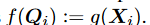
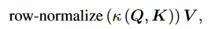
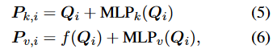
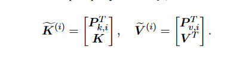
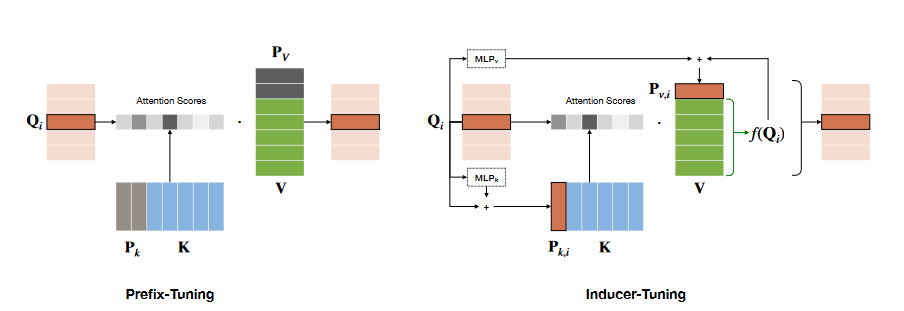
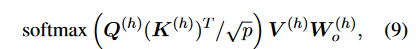

# Inducer论文笔记

发布时间：2024-12-18  
最后更新：2025-03-04  
归档主题：大模型服务与参数调优  
原文：https://sysufyj.github.io/2024/12/18/Inducer%E8%AE%BA%E6%96%87%E7%AC%94%E8%AE%B0/

> 从网页恢复的阅读副本；非 Hexo 原始 Markdown。

## 论文1

* 目前基于提示的一个缺点是难以搜索正确的提示。为了打开“提示”的黑匣子，在这项工作中，我们建议将提示（无论是硬提示（明确、固定的输入）还是软提示（隐含的向量权重））视为核方法中的“诱导变量”。

这个内核视角解释了前缀调优的潜在机制，并激发了一种新方法——诱导调优。具体来说，与其他基于提示的方法一样，inducertuning 会冻结 PLM 中的所有原始参数；当计算每层中某个输入标记的注意力输出时，诱导器调整利用靠近查询向量的点作为“诱导器”。这种独特的“软提示”简化了对适当提示的搜索，并在“提示”和“适配器调整”之间建立了新的联系。总之，这项工作的贡献有三方面： 1 我们解释了前缀调整作为内核学习中的诱导变量的基本机制。 2 我们提出了一种新的参数高效自适应技术，即诱导器调整，以进一步改进前缀调整。 3 通过全面的实证研究，我们验证了我们提出的方法可以缩小相对较小的 PLM 上“前缀调整”和“微调”之间的差距，并为连续提示调整的潜力提供更严格的下限。

### 相关工作

adapter tunning：在模型前加入一个可训练的MLP层

prompt-tuning：提示将特定于任务的指令添加到任务输入之前，最初在 Brown 等人中进行了演示。 （2020）。由于手动提示依赖于反复试验，其他人建议搜索算法来指定词汇表中所有标记之间的提示。 Prompt-tuning (Lester et al., 2021) 和 P-tuning (Liu et al., 2021b) 通过使用可训练的“软提示”消除了提示的词汇限制。

上述方法中的提示仅插入到PLM的底部嵌入层中，而Prefix-tuning（Li和Liang，2021；Liu等人，2021a）则在所有Transformer层中添加软提示，以进一步提高提示能力。尽管有效，但软提示的正确初始化仍然具有挑战性。为了缓解这个问题，Li and Liang (2021) 使用了额外的 MLP 来重新参数化每层中的提示，从而添加更多需要训练的参数；

相比之下，尽管适配器具有与前缀调整类似的表达形式（He et al., 2021a），但适配器调整只需要常规初始化。我们推测适配器的残差形式可以缓解初始化问题，因为新模型中每一层的输出将以冻结 PLM 中的输出为中心，并且残差形式有助于梯度反向传播，就像跳跃连接一样。我们依靠这种直觉并利用适配器的上述优点来指导我们提出的感应器调谐的设计

#### Transformer层预知识

根据输入得到Q K V ，再根据Q K V计算总的注意力。

### 参数高效的诱导器调整

核函数：将低维特征映射到高维空间，以更好地完成分类等任务。【<https://cloud.tencent.com/developer/article/1059190>

#### 作为核估计器的注意力

注意力表示可以看作是通过支持点{Kj}jn=1将输入查询向量Qi修改为f(Qi)

k为核函数

#### 前缀调优和诱导变量的引入

前缀调整改变每一层的注意力输出。具体来说，它将长度为 l 的前缀向量 Pk, Pv ∈ Rl×p 分别添加到 K 和 V 之前；对于某个查询标记 Qi（查询矩阵 Q 的第 i 行），其注意力输出 f (Qi) := Attn(Qi, K, V ) 更新为 f (Qi) 和 Attn( Qi, Pk, Pv)。

这两类虚拟token扮演着不同的角色。虚拟向量 Pk 适用于经验核矩阵部分，并且可以改变注意力分数（从而改变 Attn(Qi, Pk, Pv) 的权重）；而Pv在value部分生效。前缀调整对这两个虚拟向量进行建模可能不是最佳选择。在第 4.3 节中，我们将展示诱导器调整如何通过不同的残差形式解决这两个部分。

我们建议可以通过内核学习文献中引入变诱导量的概念来进一步理解前缀调整的机制。核学习中的许多计算方法利用一小组支持点（诱导变量）来提高推理性能（Musco 和 Musco，2017；Chen 和 Yang，2021）。 Snelson 和 Ghahramani (2005) 特别将诱导变量视为辅助伪输入，并使用连续优化来推断它们，这与前缀调整类似。我们强调，从表面上看，支持点方法的主**要特点是通过少量的点来表示大量的训练样本，从而降低计算成本**；然而，这里我们的目标是**利用诱导变量的机制来很好地引导估**计：我们试图实现的目标是通过使前缀更好地调节注意力输出来加强前缀调整。（通过前缀（类似于诱导点）调整模型的注意力输出，使得模型能够更好地对上下文进行建模。）

##### 诱导点方法中良好引导推理输出的机制

从概念上讲，归纳变量有助于推理，因为它们可以表示查询输入的分布并引导内核方法，而无需更改正在使用的内核。特别是，我们考虑无约束诱导点 XM 的分布模式（Snelson 和 Ghahramani，2005，图 1）。我们观察到它们中的大多数都接近测试示例 X\*，并且在新的估计中（Snelson 和 Ghahramani，2005，方程（8）），诱导器 XM 将通过核方法中的权重分配机制获得很大的权重（核方法可以分配样本的权重作为注意力（Choromanski et al., 2020; Chen et al., 2021; Tsai et al., 2019）；为了诱导变量接近查询，它们会自动受到更多关注），从而有效地调节输出。

**翻译：**靠近测试点的诱导点可以得到更大的权重（并由核函数进行分配），距离测试点越近的诱导点，权重越高。通过少量的诱导点，可以降低计算成本，同时保持推断的质量。（这不是拿测试集投入训练吗）

从这个机制中，我们得出一个归纳结论“**前缀应该接近查询**”（这在之前的前缀调优方法中没有强制执行），并相应地提出 Inducer-Tuning。我们注意到，由于我们并不追求引入变量的最初目标，即降低计算成本，而是进一步利用诱导变量的机制并改进前缀调整。

### 方法

Inducer-tuning 遵循与 prefix-tuning 相同的设计原则，通过插入虚拟标记（向量）来调节注意力输出。然而，与前缀调整不同，我们的虚拟token不在输入序列之间共享。Inducer-tuning 还结合了残差形式的优点，以简化初始化并消除前缀调整中的重新参数化技巧。

具体来说，我们进行以下修改：

1. “inducer”适应并针对每个输入标记进行定制，以增强新注意力输出的表达能力。（创新点1）
2. 我们建议将虚拟向量以残差形式建模为适配器，这使得最终的注意力输出也是残差形式。我们现在深入讨论修改背后的直觉。（创新点2）

#### 适应性Inducer【创新点】

固定的prefix-tuning有以下缺点：

**输入查询分布的动态变化**：

* 固定的前缀可能无法涵盖所有输入查询分布，导致前缀在一些输入场景中失去有效性。
* 这意味着固定前缀无法始终像核方法中的诱导变量那样高效调节推断输出。

**长输入的特殊挑战**：

* 对于长输入，可能存在某些查询向量（query vectors）与固定前缀中的虚拟向量（virtual vectors）距离较远（以 L2 距离为度量）。
* 这种距离差异会导致固定前缀无法有效调节注意力输出（attention output），从而影响模型的性能。

#### adapter-inducer设计

为了缓解固定前缀的局限性，提出了一种新的方法：对于每个查询Q\_i，选取一个与其接近的虚拟key向量作为前缀。这种自适应建模希望能提高模型在推断时的表现，尤其是在处理动态查询和长输入时。

虚拟的K和V的设计机制与内核估计器一致：值 V 独立于查询序列 Q 并与支持点 K 相关。具体来说，考虑到我们上面的设计，虚拟K向量接近 Qi（我们将虚拟K向量作为输入查询向量 Qi 的变换），我们建议将虚拟V向量相应地建模为 Qi 的映射，这意味着虚拟V向量也自适应输入的Q向量。

#### adapter-结构

为了稳定训练过程，我们建议将适配器结构合并到虚拟K/V向量的建模中。具体来说，对于第i个标记Qi（在某个头部），我们分别将相应的虚拟拟K/V向量表示为

其中 MLPk/v 都将返回与输入 Qi 具有相同维度的向量。

  
这里面额度Pkj和Pvi是根据Q动态定制的，而非一组固定的共享变量。

### 扩大值的范围【创新点】

将前缀向量 Pv,i’s 与 V (h)W (h) o 中的行对齐，而不是像前缀调整中那样仅使用 V (h) 。扩展 Pv,i 的详细实现在附录 B.3 中提供。我们可以通过第 6.2 节中的**消融研究来验证此扩展的改进**。

### 提示的潜在局限性【创新点】

基于提示的方法的潜在限制来自于冻结的权重矩阵 Wq 和 Wk（线性变换矩阵）。对于头部中的所有 n(n + l) 对查询/键向量，大多数对（对应于 QKT 中的元素）具有不变性。在提示调优（prompt-based methods）中，这些矩阵通常在预训练阶段已经学习好，并在下游任务中保持**冻结**，即不更新。

在注意力机制中，查询和键的交互（通过 QK^T 计算）决定了注意力分布。冻结 Wq和 Wk 意味着下游任务无法调整这些交互的规则，所有查询 / 键向量对的交互模式是固定的。

在每个注意力头中，有 n(n+l) 个查询 / 键向量对（其中 n 是查询序列长度，l是前缀长度）。由于 Wq和 Wk冻结，这些向量对的**位置交互关系**（pairwise positional interactions）是**不变的**。

数据集通常与预训练任务不同，导致查询向量 Q 和键向量 K 的分布发生显著变化。另外，提示调优引入的虚拟标记（virtual tokens）也会改变输入的特性。冻结的 Wq 和 Wk无法适应这些变化，不一定能有效地反映下游任务中查询和键的关系。冻结权重的设计没有办法确保 Q,K的交互模式在新的任务中依然合理。

这段话建议通过 LoRA 机制对 W\_q 进行补充，使其在训练时具有一定的调节能力。

* **LoRA 的公式**：

  + LoRA 提出的更新形式为：

    Wq←Wq+BA

    其中：

    - Wq：预训练得到的查询向量生成矩阵，保持冻结，不会被直接训练。
    - B∈RNhp×r：一个低秩矩阵，可训练。
    - A∈Rr×Nhp：另一个低秩矩阵，可训练。
    - r：一个远小于 N\_hp 的秩，确保额外引入的参数规模较小。
* **核心思想**：  
  LoRA 通过将训练限制在 B 和 A 这两个小矩阵上，以低秩形式对 Wq​ 进行调整。这种方式既保留了原始 Wq​ 的大部分结构，又引入了适应性调节能力。

### 最终模型

最终模型。我们最终提出的模型进行如下推理：

1. 在每一层中，我们首先应用方程（10）来更新 Wq，然后再获得 Q、K、V ；
2. 构造诱导子矩阵 Pk = Q + MLPk(Q)，并计算第 i 个分量的向量 ai = ⟨Qi, Pk,i⟩；基于Q这个询问的诱导信号。
3. 计算矩阵乘积[a; QKT ]/√p，然后对乘积执行softmax——第一列（表示为p）是等式（7）中的权重λi；
4. 得到 ̄ f (Q) 如式（9）所示，并返回 ̄ f (Q) + diag(p)MLPv(Q) （对应于式（8））作为完整的注意力输出。

### 实验

主要进行自然语言生成实验。
