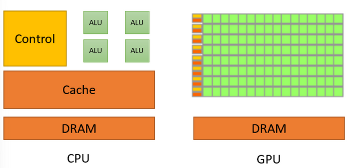
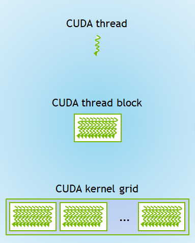

# cuda基础

发布时间：2025-01-29  
最后更新：2025-03-04  
归档主题：CUDA 与 Transformer 基础  
原文：https://sysufyj.github.io/2025/01/29/cuda%E5%9F%BA%E7%A1%80%E6%93%8D%E4%BD%9C/

> 从网页恢复的阅读副本；非 Hexo 原始 Markdown。

### GPU结构

GPU底层适合完成一些与机器学习负责的部分高度重合的任务。比如向量加法、矩阵乘法、偏微分方程求解等计算量大但并行性高的任务等。

GPU 的设计哲学是吞吐量（throughput）比延迟更加重要。（数据并行）让大量数据可以被同时处理，GPU 使用大量的晶体管来堆砌大量的运算单元，通过同时让许多运算单元共享同一个控制单元，以节约晶体管。

经典老图



对于3D画面的渲染管线：包含Vertex Mapping, Fragment Generation 与 Fragment Merging三个部分。一般来说让各个电路负责不同的部分，但这样容易在各个部分形成瓶颈。Nvidia在2006年退出Telsa架构，用流处理器负责某个步骤的处理，每个SM都像一个小型CPU一样可以执行其支持的指令集中的任何程序。并引申到通用计算部分。

### cuda介绍

cuda的设计思想为给显卡提交对应任务，cuda kernel相当于用于在显卡上运行的函数。

#### cuda kernel的创建与调用

cuda C++中有三类函数：（似乎相当于规定了域）

* `__host__`: 这类函数与正常的函数没有区别。其只能被 host 上执行的函数（`__host__`）调用，并在 host 上执行。
* `__global__`: 这类函数可以被任何函数调用，并在 device 上执行。
* `__device__`: 这类函数只能被 device 上执行的函数（`__device__` 或 `__global__`）调用，并在 device 上执行。

kernel就是global函数。

kernel的调用方式就是在函数名和参数列表中间加入<<<GRID\_DIM, BLOCK\_DIM>>>

\*注：在 CUDA 的编程模型中，一般称 **CPU 为 Host，GPU 为 Device**。\*

#### cuda内存管理

```
#include <cassert>#include <cstdio>#include <cuda_runtime_api.h>__global__ void pointwise_add_kernel(int* C, const int* A, const int* B, int n) {    for (int i = 0; i < n; ++i)        C[i] = A[i] + B[i];}int main() {    const int n = 128;    int* C = new int[n];    int* A = new int[n];    int* B = new int[n];    for (int i = 0; i < n; ++i) {        A[i] = i;        B[i] = i*i;    }    pointwise_add_kernel<<<1, 1>>>(C, A, B, n);    cudaDeviceSynchronize();    // 一个强制同步的方法    cudaError_t error = cudaGetLastError(); // 检查当前 CUDA 驱动是否返回了任何异常。调用这句话之前记得调用 cudaDeviceSynchronize()    if (error != cudaSuccess) {        printf("CUDA error: %s\n", cudaGetErrorString(error));        exit(1);    }    for (int i = 0; i < n; ++i) {        assert(C[i] == A[i] + B[i]);    }    return 0;}
```

*注：windows平台编译需要使用 nvcc -rdc=false test.cu -o test.exe防止该简单代码被当作库进行编译*

该代码会报错，因为gpu和cpu不共用一份内存，因此我们需要使用如下函数，执行与cpu内存独立的显存分配：

* `cudaMalloc()`: 在显存上申请一块存储空间，类似于 `malloc()`。
* `cudaFree()`：释放一块之前使用 `cudaMalloc()` 申请的存储空间，类似于 `free()`。
* `cudaMemcpy()`：在内存与显存之间拷贝数据，类似于 `memcpy()`。

因此，需要手动进行cuda的内存分配，修改后代码如下：

```
#include <cassert>#include <cstdio>#include <cuda_runtime_api.h>__global__ void pointwise_add_kernel(int* C, const int* A, const int* B, int n) {    for (int i = 0; i < n; ++i)        C[i] = A[i] + B[i];}int main() {    const int n = 128;    int* C = new int[n];    int* A = new int[n];    int* B = new int[n];    for (int i = 0; i < n; ++i) {        A[i] = i;        B[i] = i*i;    }    // Create 3 arrays on GPU    int* A_gpu, *B_gpu, *C_gpu;    cudaMalloc(&A_gpu, n * sizeof(int));    cudaMalloc(&B_gpu, n * sizeof(int));    cudaMalloc(&C_gpu, n * sizeof(int));    // Copy the content of A and B to A_gpu and B_gpu, respectively    cudaMemcpy(A_gpu, A, n * sizeof(int), cudaMemcpyHostToDevice);    cudaMemcpy(B_gpu, B, n * sizeof(int), cudaMemcpyHostToDevice);    pointwise_add_kernel<<<1, 1>>>(C_gpu, A_gpu, B_gpu, n);    cudaDeviceSynchronize();    // 见下方 Aside    cudaError_t error = cudaGetLastError(); // 检查当前 CUDA 驱动是否返回了任何异常。调用这句话之前记得调用 cudaDeviceSynchronize()    if (error != cudaSuccess) {        printf("CUDA error: %s\n", cudaGetErrorString(error));        exit(1);    }    // Copy the result from C_gpu to C    cudaMemcpy(C, C_gpu, n * sizeof(int), cudaMemcpyDeviceToHost);    for (int i = 0; i < n; ++i) {        assert(C[i] == A[i] + B[i]);    }    return 0;}
```

#### thread与block

为了使用GPU内部的大量小核心，需要首先了解三个概念。

* thread：从头到尾完整执行kernel的最基本执行单位
* block：若干个thread，每个thread有一个threadIdx作为Block中的id标识，blockDim代表Block中有多少thread
* grid：包含若干个block，每个thread的blockid代表线程所在的block在thread中的id，gridDim同上。每次启动kernel都会生成1个grid（执行上下文）



在cuda kernel启动时，传入的两个参数分别是block数量和thread的数量。

完善加入多个block和多个grid之后的代码如下：

```
#include <cassert>#include <cstdio>#include <cuda_runtime_api.h>__global__ void pointwise_add_kernel(int* C, const int* A, const int* B, int n) {    // 别忘了，每一个 Thread 把整个 CUDA Kernel 都完整地执行一遍，因此只需要执行自己的部分就好    for (int i = blockIdx.x*blockDim.x+threadIdx.x; i < n; i += blockDim.x*gridDim.x)        C[i] = A[i] + B[i];}int main() {    const int n = 128;    const int BLOCK_DIM = 4;    const int GRID_DIM = 3;    int* C = new int[n];    int* A = new int[n];    int* B = new int[n];    for (int i = 0; i < n; ++i) {        A[i] = i;        B[i] = i*i;    }    // Create 3 arrays on GPU    int* A_gpu, *B_gpu, *C_gpu;    cudaMalloc(&A_gpu, n * sizeof(int));    cudaMalloc(&B_gpu, n * sizeof(int));    cudaMalloc(&C_gpu, n * sizeof(int));    // Copy the content of A and B to A_gpu and B_gpu, respectively    cudaMemcpy(A_gpu, A, n * sizeof(int), cudaMemcpyHostToDevice);    cudaMemcpy(B_gpu, B, n * sizeof(int), cudaMemcpyHostToDevice);    pointwise_add_kernel<<<GRID_DIM, BLOCK_DIM>>>(C_gpu, A_gpu, B_gpu, n);    cudaDeviceSynchronize();    // 见下方 Aside    cudaError_t error = cudaGetLastError(); // 检查当前 CUDA 驱动是否返回了任何异常。调用这句话之前记得调用 cudaDeviceSynchronize()    if (error != cudaSuccess) {        printf("CUDA error: %s\n", cudaGetErrorString(error));        exit(1);    }    // Copy the result from C_gpu to C    cudaMemcpy(C, C_gpu, n * sizeof(int), cudaMemcpyDeviceToHost);    for (int i = 0; i < n; ++i) {        assert(C[i] == A[i] + B[i]);    }    return 0;}
```

### 性能分析

在冯诺依曼架构下，ALU需要从内存中取数，计算后写回，因此速度主要受到计算/访存的限制。CPU运算单元少，且有多级缓存，因此主要是computed-bound，GPU核心规模大，但内存带宽有限，主要是memory-bound。

为了估测一个cuda-kernel的性能瓶颈，可以计算算存比：即计算次数/访存次数。

如果一个 Kernel 是 Memory-bound 的，那么就优化它的访存次数（哪怕这样可能需要多进行一些计算），反之则要减少其计算次数。一般来说，Compute-bound 的 Kernel 不太常见（毕竟算存比得过百才能达到 Compute-bound）（常见的 Compute-bound 的 Kernel 可能只有矩阵乘法与卷积核比较大的卷积），所以下面我们主要关注如何优化访存。

1. `__restrict__`

指针别名：

```
void f1(int* x, int* y) {    *x += *y;  *x += *y;}void f2(int* x, int* y) {    *x += 2*(*y);}
```

假设x和y指向相同的内存，上面输出4（*x），下面输出3（*x），由于编译器无法假定该情况发生，因此无法将f1优化为f2，因此需要通过\_\_restrict\_\_关键字把指针指向的值放在寄存器里，而不是一次又一次访存从而影响性能。（即人工保证——这两个变量不会指向同一块内存，请编译器放心优化吧）

2. Memory Coalescing

gpu内部以warp为基本调度单位，每个时钟周期内，同一个warp中的线程都会执行相同的指令。

在访存的时候，gpu会把请求打包成尽可能少的Transaction，以尽量减少访存次数等。出于gpu的访存规定限制：

Transaction 需要满足：

* 长度为 32 个 Byte【一种假定，也是可以调的】
* 开始地址是 32 的倍数【每个transaction只能从32的整数倍开始获取32B的数据量】

也即：如果一个 Warp 中的第 i 个 Thread 要访问地址为 4i∼4i+3 的内存，那么一共需要 4 个 Transaction 才能读完所有的数据；如果一个 Warp 中的第 i 个 Thread 要访问地址为 4i+1∼4i+4 的内存，那么需要 5 个 Transaction 才能读取所有的数据；如果第 i 个 Warp 要访问地址为 32i∼32i+3 的内存，那么就需要 32 次 Transaction 才能完成读取了。

所以可以通过内存手动对齐，保证访问是可以被coalescing等方法进行性能优化。

3. Shared Memory

原笔记配图缺失：GPU 内存层级图（memory-hierarchy-in-gpus-1.png）。待补回原图。

Cuda中大致的内存类型包括：

* Global Memory：俗称显存，位于 GPU 核心外部，很大（比如 A100 有 80GB），但是带宽很有限
* L2 Cache：位于 GPU 核心内部，是显存的缓存，程序不能直接使用
* Register：寄存器，位于 GPU 核心内部，Thread 可以直接调用
* Shared memory：位于 GPU 核心内部，每个 Thread block 中的所有 Thread 共用同一块 Shared memory（因此，Shared memory 可以用来在同一个 Thread block 的不同 Thread 之间共享数据），并且带宽极高（因此，Shared memory 可以用来优化性能）。

如何利用shared memory优化性能？访存次数计算：

1. 加载 A：
   * 每次计算一个元素 C(i,j)，都需要读取 k个不同的 A(i,p)。
   * 总共计算 C的 n×m个元素，每个访问 k次 A(i,p)，所以 A的访存总次数为： n×m×k
2. 加载 B：
   * 每次计算 C(i,j) 需要读取 k 个不同的 B(p,j)。
   * 同理，总访存次数为： n×m×k

Tilling方法主要对矩阵进行分块，每个block负责计算C的一个子矩阵，每次在计算C的子矩阵的时候，都把A和B的一部分加载到shared memory中共享存储读取。

当对矩阵进行分块Tilling的时候，每次加载TxT(实际乘的时候只要用到Txk和kxT)的矩阵，每轮访存2\*TT，总轮数为k/T

<https://zhuanlan.zhihu.com/p/342103911>

4. Profilling Tools

在优化 CUDA Kernel 的时候，除了依照经验与惯用套路（比如 Memory coalescing），我们也可以使用专业的 Profiling 工具来测试一个 Kernel 或者一个程序的性能瓶颈。常用的 Profiling 工具包括：

* NVIDIA Nsight System: 它可以对整个应用程序进行 Profile，可以得到各个 Kernel 的耗时，以及究竟是 CPU 还是 GPU 拖慢了整体的执行速度。
* NVIDIA Nsight Compute: 它可以对单个 CUDA Kernel 进行 Profiling，进而得到该 CUDA Kernel 的瓶颈所在。它会提供许多的详细信息（比如，内存带宽占用率、CUDA Core 活跃时间比、活跃的 SM 比例等等）来帮助你更加细致地优化 CUDA Kernel。

### 代码分析

**前序配置：**

下载cuda与cudnn、安装并配置相应的visual studio文件的路径：<https://cloud.tencent.com/developer/article/2089949>

常见库介绍：

* cublas：实现了线性代数中大部分计算
* tensor core：矩阵乘法计算单元

#### step 0 示例代码部署

克隆
