# Transformer+cuda学习

发布时间：2025-02-21  
最后更新：2025-03-04  
归档主题：CUDA 与 Transformer 基础  
原文：https://sysufyj.github.io/2025/02/21/Transformer-cuda%E5%AD%A6%E4%B9%A0/

> 从网页恢复的阅读副本；非 Hexo 原始 Markdown。

## Transformer基本结构

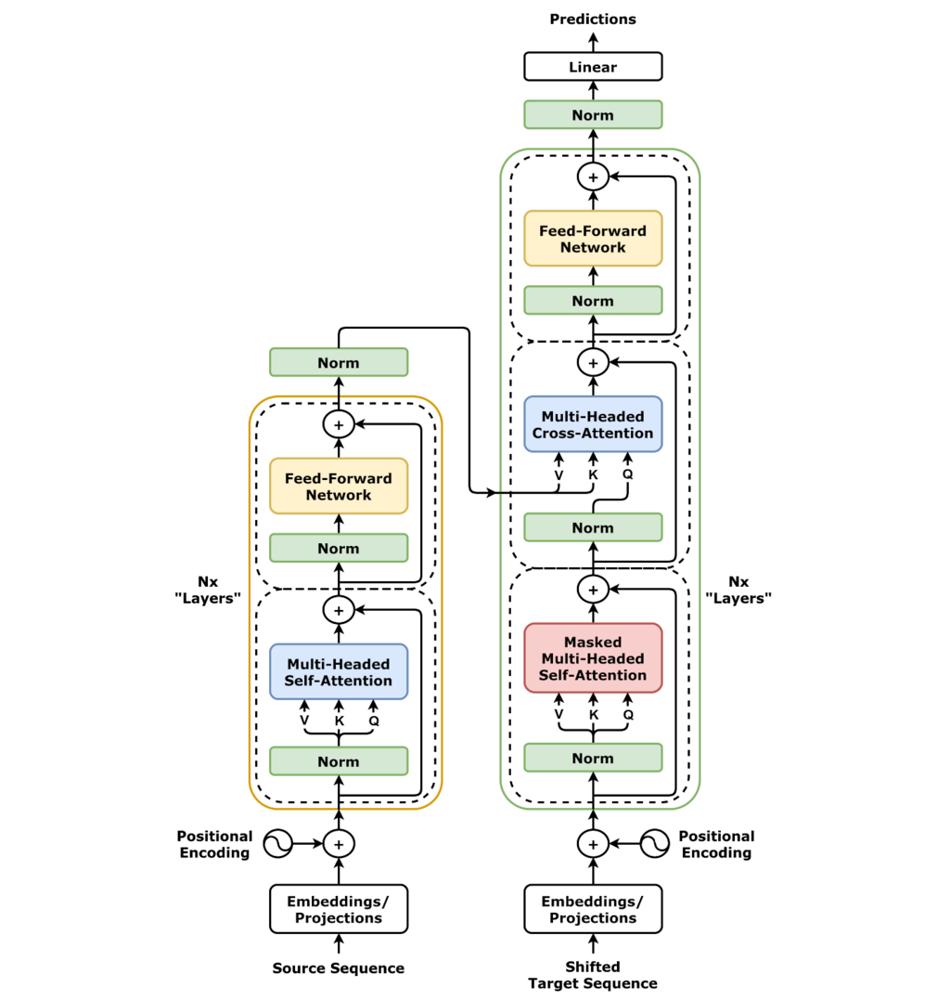

<https://zhuanlan.zhihu.com/p/338817680>

### 整体架构

可以被看作是一定层的encoder+decoder

1. 词的向量化

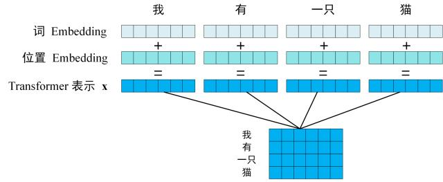

* 词Embedding包括查词表等方式，把词语本身转化为向量，位置embedding加入了词再序列中的位置信息，简单相加可得到输出。

2. 传入encoder之后，输出维度一致的编码矩阵

* encoder主要是通过FFN和多头注意力表示提取出词的位置信息。

3. 输出decoder中，decoder依据翻译过的单词1~i预测i+1

### Transformer输入

1. 单词embedding

单词的 Embedding 有很多种方式可以获取，例如可以采用 Word2Vec、Glove 等算法预训练得到，也可以在 Transformer 中训练得到。

2. 位置embedding

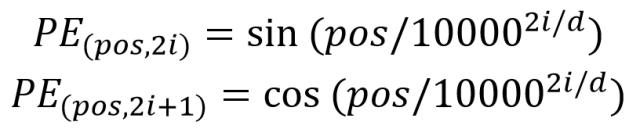

### 自注意力机制

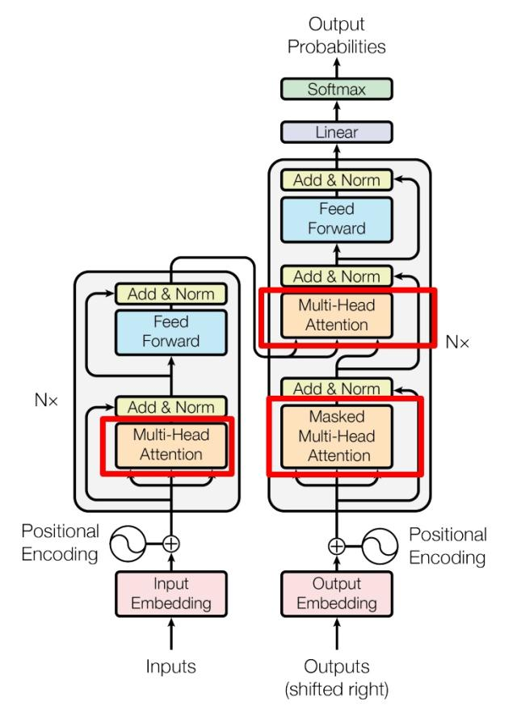

#### 公式计算

通过输入X乘以对应的权重矩阵得到具体的Q K V

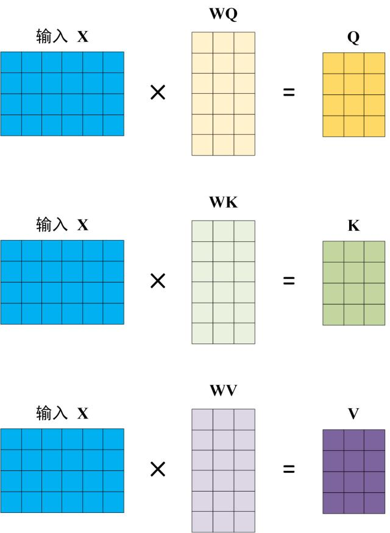

之后可以计算出注意力输出

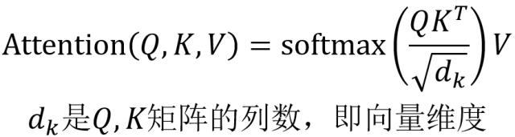

计算Q和K中每一行向量的内积，QKT相乘后的n\*n矩阵中n为单词数，这个矩阵可以表示**单词之间**的attention的强度，最后再使用softmax归一化，每一行的和都变成1.再和V相乘得到最终不同的attenton分数

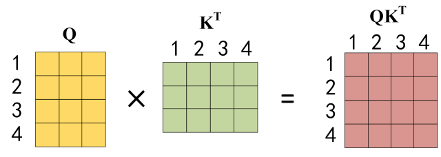

* 这里Q和K^T相乘，相当于把单词之间的注意力分数都算了出来。
* d\_k可以避免分数过大导致的梯度消失问题，因此使用根号d\_k稳定方差和数值范围（应该是向正态分布靠拢）
* Q和K表达的是词之间互相的关注程度，乘以V相当于加入了句子的输入信息。Q相当于当前的计算目标，k相当于其他目标。

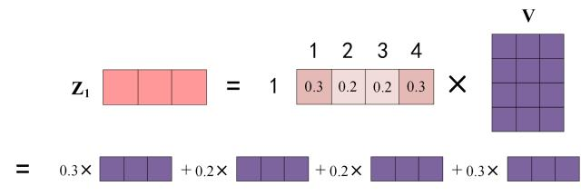

* 最终输出的计算从语义上，而非从矩阵乘法的计算上得到的是每个单词对应的V的行信息乘以对应的注意力分数。

#### 多头注意力

已经知道怎么通过 Self-Attention 计算得到输出矩阵 Z，而 Multi-Head Attention 是由多个 Self-Attention 组合形成的，下图是论文中 Multi-Head Attention 的结构图。

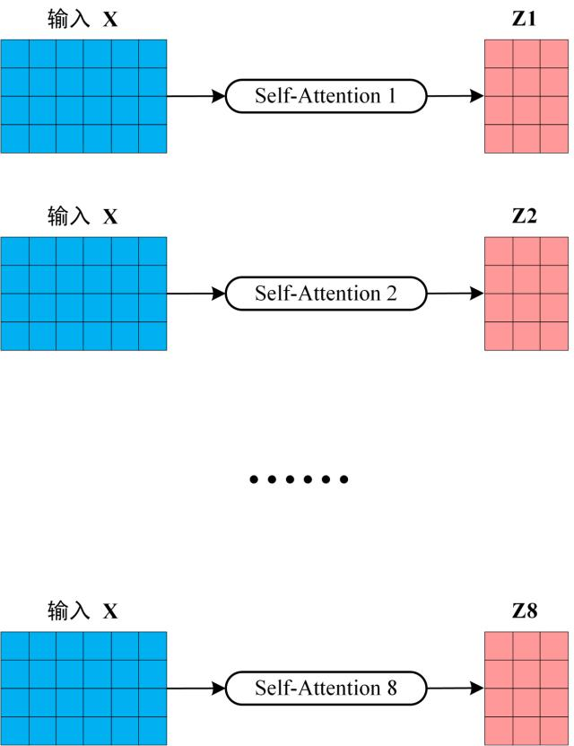  
计算出h个Z之后，多头注意力机制将其拼接后传入线形层，得到最终的输出Z，这时输出的Z与输入的X维度一致。

* 为什么拼接但不相加？这样保留了更多语义没有把不同的头进行混合，效果更好。（tokenembdding混合形成的时候不相加是因为这样就太大了）

### encoder结构

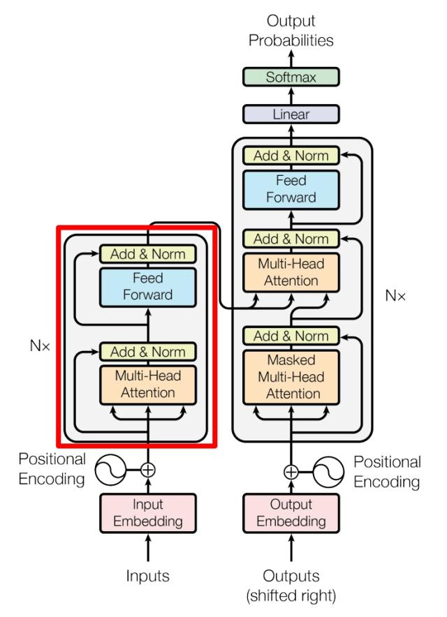

#### Add&Norm

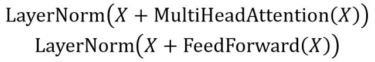

其中 **X**表示 Multi-Head Attention 或者 Feed Forward 的输入，MultiHeadAttention(**X**) 和 FeedForward(**X**) 表示输出 (输出与输入 **X** 维度是一样的，所以可以相加)。

* Add这种方式类似残差连接，让网络只关注到当前差异的部分，解决遗忘的问题。
* Norm将神经元的输入转化成均值方差都为0和1的形式，可以加快收敛。（**在每个样本的同一层神经元上计算均值和标准差**，然后对其进行归一化，使其具有**零均值**和**单位方差**。）

#### FFN层

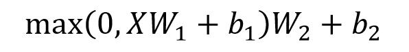

* **x**：输入（通常是注意力机制的输出）。
* **W₁, b₁**：第一层的权重和偏置，作用是将输入从 **d\_model** 维度扩展到 **更高的维度（通常是 4 倍）**。
* **W₂, b₂**：第二层的权重和偏置，作用是把数据降维回 d\_model 维度。
* **ReLU（或 GELU）**：非线性激活函数，引入非线性能力，使模型能学习更复杂的特征。

作用类似CNN，提取非线性+高维特征

### decoder结构

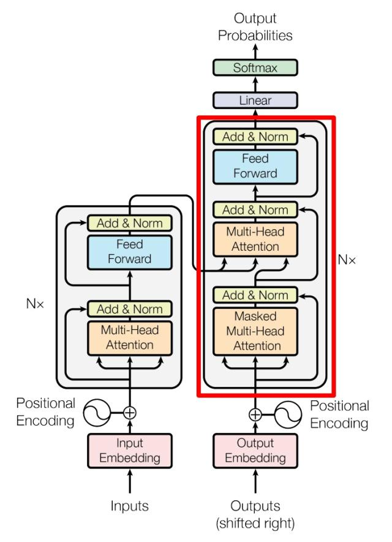

上图红色部分为 Transformer 的 Decoder block 结构，与 Encoder block 相似，但是存在一些区别：

* 包含两个 Multi-Head Attention 层。
* 第一个 Multi-Head Attention 层采用了 Masked 操作。
* 第二个 Multi-Head Attention 层的**K, V**矩阵使用 Encoder 的**编码信息矩阵C**进行计算，而**Q**使用上一个 Decoder block 的输出计算。
* 最后有一个 Softmax 层计算下一个翻译单词的概率。

#### 第一个多头注意力

Decoder block 的第一个 Multi-Head Attention 采用了 Masked 操作，因为在翻译的过程中是顺序翻译的，即翻译完第 i 个单词，才可以翻译第 i+1 个单词。通过 Masked 操作可以防止第 i 个单词知道 i+1 个单词之后的信息。同时可以利用teaching forcing传入正确答案。  
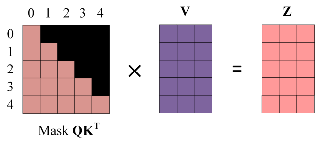

#### 第二个多头注意力

Decoder block 第二个 Multi-Head Attention 变化不大， 主要的区别在于其中 Self-Attention 的 **K, V**矩阵不是使用 上一个 Decoder block 的输出计算的，而是使用 **Encoder 的编码信息矩阵 C** 计算的。

根据 Encoder 的输出 **C**计算得到 **K, V**，根据上一个 Decoder block 的输出 **Z** 计算 **Q** (如果是第一个 Decoder block 则使用输入矩阵 **X** 进行计算)，后续的计算方法与之前描述的一致。

这样做的好处是在 Decoder 的时候，每一位单词都可以利用到 Encoder 所有单词的信息 (这些信息无需 **Mask**)。

* **在训练时，模型依赖于正确的前 i个单词，并通过 Mask 限制未来的信息**，这使得 Teacher Forcing 和 Mask 可以同时生效。测试的时候只有mask。
* 直接作为输入X去乘以各个独立的Wq

#### 最终信息

Decoder block 最后的部分是利用 Softmax 预测下一个单词，在之前的网络层我们可以得到一个最终的输出 Z，因为 Mask 的存在，使得单词 0 的输出 Z0 只包含单词 0 的信息，如下：

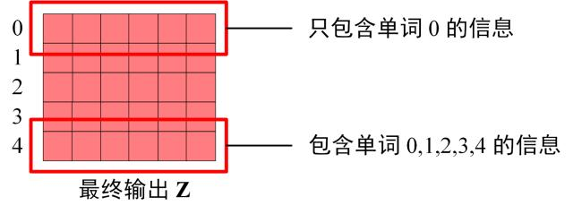

得到最终结果：  
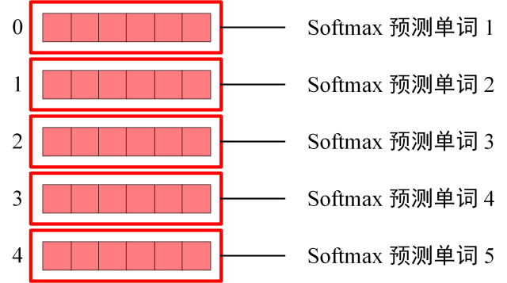
